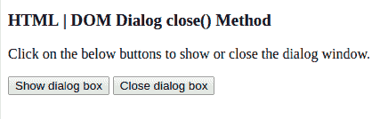
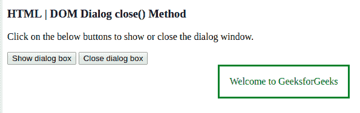
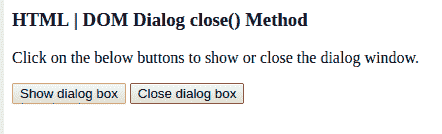

# HTML | DOM 对话框关闭()方法

> 原文:[https://www.geeksforgeeks.org/html-dom-dialog-close-method/](https://www.geeksforgeeks.org/html-dom-dialog-close-method/)

DOM 对话框关闭()方法用于关闭对话框。对话元素由 getElementById()访问。它用在 HTML5 中。
使用该方法时，用户可以与页面上的其他元素进行交互。它与 Dialog show()方法一起使用。

**语法:**

```html
dialogObject.close()
```

**示例:**本示例展示了 Dialog close()方法的工作原理:

```html
<!DOCTYPE html>
<html>
<body>

<h3> HTML | DOM Dialog close() Method</h3>
<p>Click on the below buttons to show or close the dialog window.</p>

<button onclick="showDialog()">Show dialog box</button>
<button onclick="closeDialog()">Close dialog box</button>

<dialog id="showDialog" style= "color:green">
            Welcome to GeeksforGeeks</dialog>

<script>
var gfg = document.getElementById("showDialog"); 

function showDialog() { 
gfg.show(); 
} 

function closeDialog() { 
gfg.close(); 
} 
</script>

</body>
</html>                    

```

**输出:**
点击按钮前:


点击显示按钮后:


点击关闭按钮后:


**支持的浏览器:**

*   谷歌 Chrome 37.0
*   Opera 24.0
*   Safari 6.0