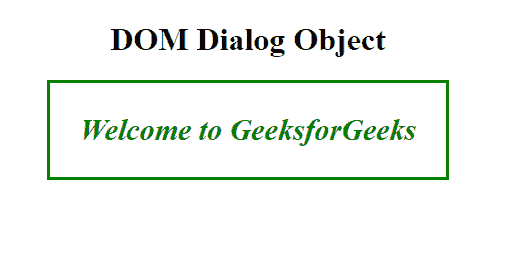
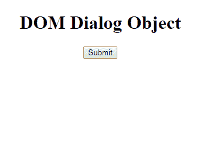

# HTML | DOM 对话框对象

> 原文:[https://www.geeksforgeeks.org/html-dom-dialog-object/](https://www.geeksforgeeks.org/html-dom-dialog-object/)

**DOM 对话框对象**用于表示 HTML [<对话框>](https://www.geeksforgeeks.org/html5-dialog-tag/) 元素。对话元素由 *getElementById()* 访问。它用在 HTML5 中。

**语法:**

```html
document.getElementById("ID");
```

其中“id”是分配给**“对话框”**标签的 ID。

**示例-1:**

```html
<!DOCTYPE html>
<html>

<head>
    <title>DOM dialog Object</title>
    <style>
        dialog {
            color: green;
            font-size: 30px;
            font-weight: bold;
            font-style: italic;
        }

        body {
            text-align: center;
        }
    </style>
</head>

<body>
    <h1>DOM Dialog Object</h1>

    <!-- Assigning id to dialog tag -->
    <dialog id="GFG">Welcome to GeeksforGeeks</dialog>

    <button onclick="myGeeks()" open>Submit</button>
    <script>
        function myGeeks() {
            // Accessing dialog tag
            var x = document.getElementById("GFG");

            x.open = true;
        }
    </script>
</body>

</html>
```

**输出:**

**点击按钮前:**


**点击按钮后:**


**示例-2:** 可以使用**文档创建元素方法创建对话框对象。**

```html
<!DOCTYPE html>
<html>

<head>
    <title>DOM dialog Object</title>
    <style>
        dialog {
            color: green;
            font-size: 30px;
            font-weight: bold;
            font-style: italic;
        }

        body {
            text-align: center;
        }
    </style>
</head>

<body>
    <h1>DOM Dialog Object</h1>

    <button onclick="myGeeks()" open>Submit</button>
    <script>
        function myGeeks() {
            var gfg = 
            document.createElement("DIALOG");

            var f = 
            document.createTextNode("Welcome to GeeksForGeeks");

            gfg.setAttribute("open", "open");
            gfg.appendChild(f);
            document.body.appendChild(gfg);
        }
    </script>
</body>

</html>
```

**输出:**

**点击按钮前:**


**点击按钮后:**


**支持的浏览器:****DOM 对话框对象**支持的浏览器如下:

*   谷歌 Chrome 37+
*   Opera 24+
*   Safari 6+