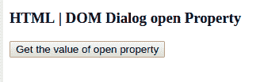
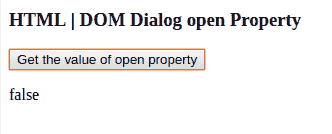
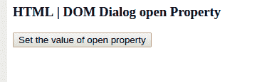
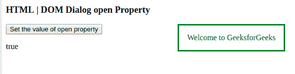

# HTML | DOM 对话框打开属性

> 原文:[https://www . geesforgeks . org/html-DOM-dialog-open-property/](https://www.geeksforgeeks.org/html-dom-dialog-open-property/)

DOM 对话框打开属性用于设置或返回对话框是否应该打开。它在 HTML5
中是新的，如果打开，意味着用户可以与之交互。

**语法:**

*   它返回开放属性:

    ```html
    dialogObject.open
    ```

*   设置开放属性:

    ```html
    dialogObject.open = true|false
    ```

**属性值:**它接受两个值，即 true|false，指定对话框窗口是否应该打开。默认情况下，它是假的。

*   **真:**表示对话窗口打开。*   **false:** It states that the dialog window is not open.

    **示例-1:** 本示例返回对话框打开属性的值。

    ```html
    <!DOCTYPE html>
    <html>
    <body>

    <h3> HTML | DOM Dialog open Property</h3>

    <dialog id="Dialog" style= "color:green">
                Welcome to GeeksforGeeks</dialog>

    <button onclick = "openDialog()"> 
    Get the value of open property </button>
    <p id = "geeks"> </p>

    <script>
    function openDialog() { 
    var gfg = document.getElementById("Dialog").open; 
    document.getElementById("geeks").innerHTML = gfg;
    } 
    </script>

    </body>
    </html>                    

    ```

    **输出:**
    点击按钮前:
    

    点击按钮后:
    

    **示例-2:** 本示例设置对话框打开属性的值。

    ```html
    <!DOCTYPE html>
    <html>
    <body>

    <h3> HTML | DOM Dialog open Property</h3>

    <dialog id="Dialog" style= "color:green">
                Welcome to GeeksforGeeks</dialog>

    <button onclick = "openDialog()"> 
    Set the value of open property </button>
    <p id = "geeks"> </p>

    <script>
    function openDialog() { 
    var gfg = document.getElementById("Dialog").open = true; 
    document.getElementById("geeks").innerHTML = gfg;
    } 
    </script>

    </body>
    </html>                    

    ```

    **输出:**
    点击按钮前:
    

    点击按钮后:
    

    **支持的浏览器:**

    *   谷歌 Chrome
    *   歌剧
    *   旅行队