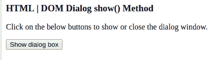
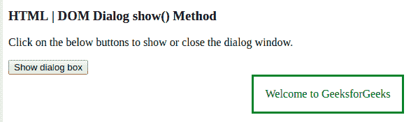

# HTML | DOM 对话框显示()方法

> 原文:[https://www.geeksforgeeks.org/html-dom-dialog-show-method/](https://www.geeksforgeeks.org/html-dom-dialog-show-method/)

DOM Dialog show()方法用于显示对话框。对话元素由 getElementById()访问。它用在 HTML5 中。
使用该方法时，用户可以与页面上的其他元素进行交互。

**语法:**

```html
dialogObject.show()
```

**示例:**本示例展示了 Dialog show()方法的工作原理:

```html
<!DOCTYPE html>
<html>
<body>

<h3> HTML | DOM Dialog show() Method</h3>
<p>Click on the below buttons to show or close the dialog window.</p>

<button onclick="showDialog()">Show dialog box</button>

<dialog id="showDialog" style= "color:green">
            Welcome to GeeksforGeeks</dialog>

<script>
var gfg = document.getElementById("showDialog"); 

function showDialog() { 
gfg.show(); 
} 
</script>

</body>
</html>                    

```

**输出:**
点击按钮前:


点击按钮后:


**支持的浏览器:**

*   谷歌 Chrome 37.0
*   Opera 24.0
*   Safari 6.0