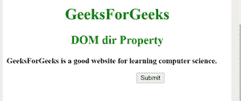
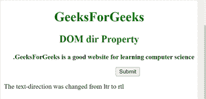
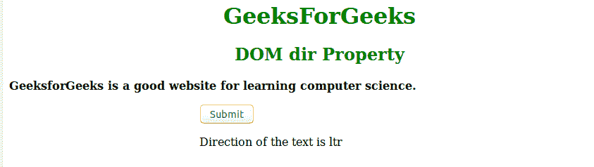

# HTML | DOM 目录属性

> 原文:[https://www.geeksforgeeks.org/html-dom-dir-property/](https://www.geeksforgeeks.org/html-dom-dir-property/)

DOM 目录属性用于设置或返回元素中目录属性的值。它定义了元素内容中文本的方向。
**语法**

```html
HTMLElementObject.dir
```

**返回值:**返回文本的方向。

```html
HTMLElementObject.dir = "ltr|rtl|auto"
```

**属性:**

*   **ltr** :默认值，用于返回从左向右的文本方向。
*   **rtl** :用于返回从右向左的文字方向。

**示例-1:** 更改文本的方向。

## 超文本标记语言

```html
<!DOCTYPE html>
<html>

<head>
    <title>
        HTML | DOM dir Property
    </title>
    <style>
        button {
            margin-left: 270px;
        }
    </style>
</head>

<body>
    <h1 style="color:green;font-weight:bold;text-align:center;">
    GeeksForGeeks
    </h1>
    <h2 style="color:green;font-weight:bold;text-align:center">
    DOM dir Property
    </h2>
    <p id="sudo" dir="ltr">
        <b>
        GeeksForGeeks is a good website for
        learning computer science.
        </b>
    </p>

    <button onclick="geeks()">Submit</button>

    <p id="GFG"></p>

    <script>
        function geeks() {
        var g =    document.getElementById("sudo").dir = "rtl";
            document.getElementById("GFG").innerHTML = "The text-direction was changed  from ltr to " + g;
        }
    </script>

</body>

</html>
```

**点击按钮前:**



**点击按钮后:**



**例-2** :获取文字的方向。

超文本标记语言

**点击按钮前:**


**点击按钮后:**



**支持的浏览器:**DOM Dir 属性支持的浏览器如下:

*   谷歌 Chrome
*   微软公司出品的 web 浏览器
*   火狐浏览器
*   歌剧
*   旅行队