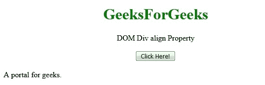
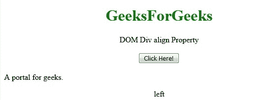
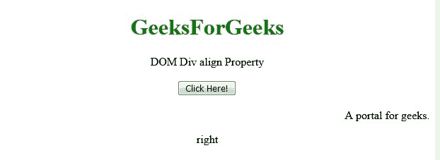

# HTML | DOM Div 对齐属性

> 原文:[https://www.geeksforgeeks.org/html-dom-div-align-property/](https://www.geeksforgeeks.org/html-dom-div-align-property/)

**HTML | DOM Div align 属性**用于设置或返回< div >元素的 align 属性值。
**语法:**

*   它返回 div align 属性。

```html
div object.align;
```

*   它设置 div align 属性。

```html
div object.align="left | right | center"
```

**房产价值:**

*   **左:**它将左对齐设置为< div >元素。
*   **居中:**设置居中对齐 div 元素。这是默认值。
*   **右:**设置右对齐< div >元素。

**返回值:**返回一个代表 Div 元素对齐方式的字符串值。
**示例 1:** 本示例返回 Div align 属性。

## 超文本标记语言

```html
<!DOCTYPE html>
<html>

<head>
    <title>
        HTML DOM Div align Property
    </title>
</head>

<body style = "text-align:center;">

    <h1 style = "color:green;" >
        GeeksForGeeks
    </h1>

    <div id="div_obj">DOM Div align Property</div>
    <br>

    <button onclick = "Geeks()">
        Click Here!
    </button>

    <br><br>

    <div id = "GFG" align="left">
        A portal for geeks.
    </div>
    <p id="geeks"></p>

    <!-- script to access div object -->
    <script>
        function Geeks() {
            var dv = document.getElementById("GFG").align;
            document.getElementById("geeks").innerHTML = dv;
        }
    </script>
</body>

</html>                    
```

**输出:**
**点击按钮前:**



**点击按钮后:**



**示例 2:** 本示例设置 Div 对齐属性。

## 超文本标记语言

```html
<!DOCTYPE html>
<html>

<head>
    <title>
        HTML DOM Div align Property
    </title>
</head>

<body style = "text-align:center;">

    <h1 style = "color:green;" >
        GeeksForGeeks
    </h1>

    <div id="div_obj">DOM Div align Property</div>
    <br>

    <button onclick = "Geeks()">
        Click Here!
    </button>

    <br><br>

    <div id = "GFG" align="left">
        A portal for geeks.
    </div>
    <p id="geeks"></p>

    <!-- script to access div object -->
    <script>
        function Geeks() {
            var dv = document.getElementById("GFG").align = "right";
            document.getElementById("geeks").innerHTML = dv;
        }
    </script>
</body>

</html>
```

**输出:**
**点击按钮前:**


**点击按钮后:**



**支持的浏览器:**T2 DOM Div align Property 支持的浏览器如下:

*   谷歌 Chrome
*   微软公司出品的 web 浏览器
*   火狐浏览器
*   苹果 Safari
*   歌剧