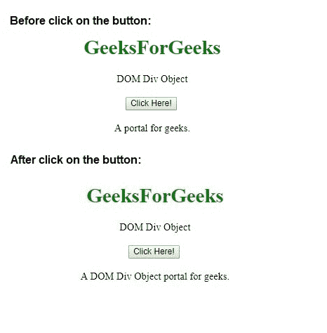
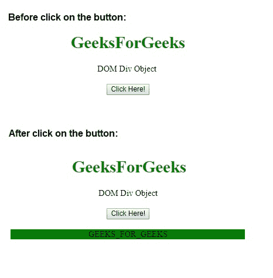

# HTML | DOM Div 对象

> 原文:[https://www.geeksforgeeks.org/html-dom-div-object/](https://www.geeksforgeeks.org/html-dom-div-object/)

HTML DOM 中的 **Div 对象**用来表示 HTML < div >元素。这个标签用于为其他 HTML 元素指定容器，以便用 CSS 为它们设置样式，或者用 JavaScript 执行某些任务。

**语法:**

*   使用 getElementById()方法可以访问元素。

```html
var x = document.getElementById("myDIV");
```

*   可以使用 createElement()方法创建元素。

```html
var x = document.createElement("DIV");
```

**属性值:**

*   [**<u>align:</u>**](https://www.geeksforgeeks.org/html-dom-div-align-property/)**用于设置或返回< div >元素的 align 属性的值。HTML 5 不支持。在 HTML 5 中使用了 style.textAlign 而不是 Align。**

****示例 1:** 可以使用 document.getElementById()方法访问 Div 对象。**

## **超文本标记语言**

```html
<!DOCTYPE html>
<html>

<head>
    <title>
        HTML DOM Div Object
    </title>
</head>

<body style = "text-align:center;">

    <h1 style = "color:green;" >
        GeeksForGeeks
    </h1>

    <div id="div_obj">DOM Div Object</div>
    <br>

    <button onclick = "Geeks()">
        Click Here!
    </button>

    <br><br>

    <div>
        A <span id = "GFG"></span> portal for geeks.
    </div>

    <!-- script to access div object -->
    <script>
        function Geeks() {
            var dv = document.getElementById("div_obj").innerHTML;
            document.getElementById("GFG").innerHTML = dv;
        }
    </script>
</body>

</html>                   
```

****输出:**** 

****

****示例 2:** 可以使用 document.createElement 方法创建 Div 对象。**

## **超文本标记语言**

```html
<!DOCTYPE html>
<html>
    <head>
        <title>
            HTML DOM Div Object
        </title>
    </head>

    <body style = "text-align:center;">

        <h1 style = "color:green;" >
            GeeksForGeeks
        </h1>

        <h2>DOM Div Object</h2>

        <button onclick = "Geeks()">
            Click Here!
        </button>

        <br><br>

        <!-- script to create Div object -->
        <script>
            function Geeks() {
            var x = document.createElement("DIV");
            var t = document.createTextNode("GEEKS_FOR_GEEKS.");
            x.setAttribute("style", "background-color: green;");
            x.appendChild(t);
            document.body.appendChild(x);
            }
        </script>

    </body>
</html>                   
```

****输出:**** 

****

****支持的浏览器:****HTML DOM Div 对象支持的浏览器如下所列**:**

*   **谷歌 Chrome**
*   **微软公司出品的 web 浏览器**
*   **火狐浏览器**
*   **歌剧**
*   **旅行队**