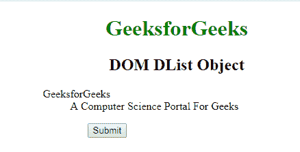
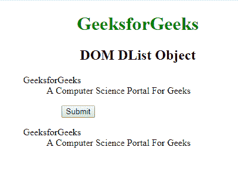
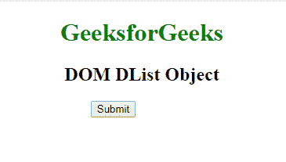
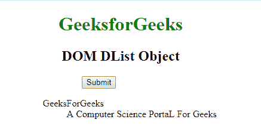

# html \ DOM 列表对象

> 原文:[https://www.geeksforgeeks.org/html-dom-dlist-object/](https://www.geeksforgeeks.org/html-dom-dlist-object/)

**DOM 数据列表对象**用于表示 HTML [< dl >](https://www.geeksforgeeks.org/html-dl-tag/) 标签。数据列表元素由 **getElementById()** 访问。

**语法:**

```html
document.getElementById("ID");<
```

其中“id”是分配给**“dl”**标签的 ID。
**例-1:**

## 超文本标记语言

```html
<!DOCTYPE html>
<html>

<head>
    <title>dl tag</title>
    <style>
        h1,
        h2 {
            text-align: center;
        }

        h1 {
            color: green;
        }

        dl {
            margin-left: 20%;
        }

        button {
            margin-left: 30%;
        }
    </style>
</head>

<body>
    <h1>GeeksforGeeks</h1>
    <h2>DOM DList Object</h2>

    <!-- Assigning id to 'dl' tag -->
    <dl id="GFG">
        <dt>GeeksforGeeks</dt>
        <dd>A Computer Science Portal For Geeks</dd>
    </dl>

    <button onclick="myGeeks()">Submit</button>
    <p id="sudo"></p>

    <script>
        function myGeeks() {
            <!-- Accessing 'dl'. -->
            var g = document.getElementById("GFG").innerHTML;
            document.getElementById("sudo").innerHTML = g;
        }
    </script>
</body>

</html>
```

**输出:**
**点击按钮前:**



**点击按钮后:**



**示例-2:可以使用 **document.createElement** 方法创建数据列表**对象。

## 超文本标记语言

```html
<!DOCTYPE html>
<html>

<head>
    <title>dl tag</title>
    <style>
        h1,
        h2 {
            text-align: center;
        }

        h1 {
            color: green;
        }

        dl {
            margin-left: 20%;
        }

        button {
            margin-left: 30%;
        }
    </style>
</head>

<body>
    <h1>GeeksforGeeks</h1>
    <h2>DOM DList Object</h2>
    <button onclick="myGeeks()">Submit</button>

    <script>
        function myGeeks() {
            var g = document.createElement("DL");
            g.setAttribute("id", "GFG");
            document.body.appendChild(g);

            var f = document.createElement("DT");
            var text = document.createTextNode("GeeksForGeeks");
            f.appendChild(text);

            document.getElementById("GFG").appendChild(f);

            var z = document.createElement("DD");
            var text2 = document.createTextNode(
              "A Computer Science PortaL For Geeks");

            z.appendChild(text2);
            document.getElementById("GFG").appendChild(z);
        }
    </script>
</body>

</html>
```

**输出:**
**点击按钮前:**



**点击按钮后:**



**支持的浏览器:**下面列出了 **DOM DList 对象**支持的浏览器。

*   谷歌 Chrome
*   微软公司出品的 web 浏览器
*   火狐浏览器
*   歌剧
*   旅行队