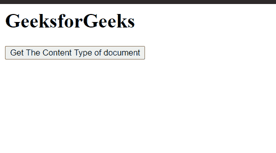
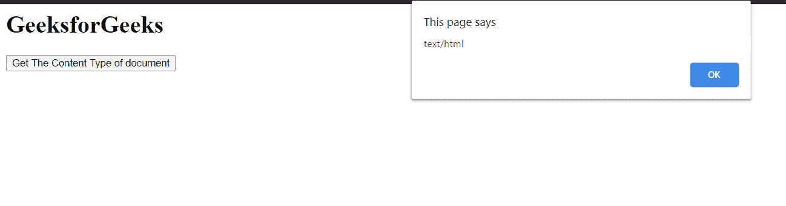

# HTML DOM 文档内容类型属性

> 原文:[https://www . geesforgeks . org/html-DOM-document-content type-property/](https://www.geeksforgeeks.org/html-dom-document-contenttype-property/)

HTML DOM 中的 **contentType** 属性返回文档呈现的 **MIME** 类型。这是只读属性。

**语法:**

```html
value = document.contentType;
```

**返回值:**该属性**返回文档 MIME 内容类型的字符串值**。

**示例:**本示例将展示如何使用该属性获取文档的内容 MIME Type。

## 超文本标记语言

```html
<!DOCTYPE html>
<html>

<body>
    <h1>GeeksforGeeks</h1>

    <button onclick="get()">
        Get The Content Type
        of document
    </button>

    <script>
        function get() {
            alert(document.contentType);
        }
    </script>
</body>

</html>
```

**输出:**

 ****点击按钮前:**

** 

 ****点击按钮后:**

** 

**支持的浏览器:**

*   谷歌 Chrome
*   边缘
*   火狐浏览器
*   歌剧
*   旅行队
*   微软公司出品的 web 浏览器