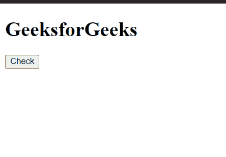
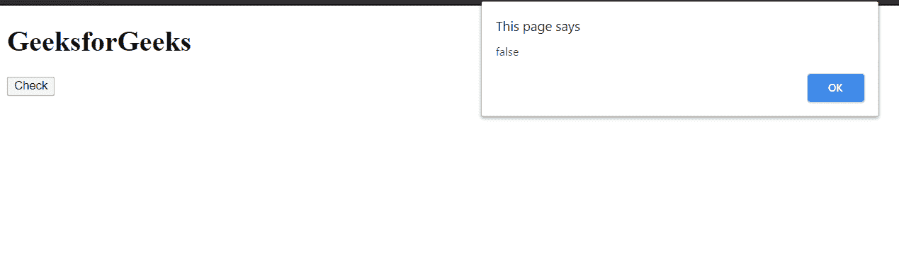

# HTML DOM 文档隐藏属性

> 原文:[https://www . geesforgeks . org/html-DOM-document-hidden-property/](https://www.geeksforgeeks.org/html-dom-document-hidden-property/)

文档**隐藏**属性返回一个**布尔**值，指示**页面是否被视为隐藏**。这是只读属性。

**语法:**

```html
var bool = document.hidden;
```

**返回值:**该属性返回一个**布尔值–**

*   如果页面被认为是隐藏的，则**为真**。
*   如果页面未被视为隐藏，则**为假**

**示例:**这个示例展示了如何使用这个属性来检查页面是否隐藏。

## 超文本标记语言

```html
<!DOCTYPE html>
<html>

<body>
    <h1>GeeksforGeeks</h1>

    <button onclick="get()">
        Check
    </button>

    <script type="text/javascript">
        function get() {
            alert(document.hidden);
        }
    </script>
</body>

</html>
```

**输出:**

*   **点击按钮前:**

    

*   **点击按钮后:**

    

**支持的浏览器:**

*   谷歌 Chrome
*   微软公司出品的 web 浏览器
*   火狐浏览器
*   歌剧
*   旅行队