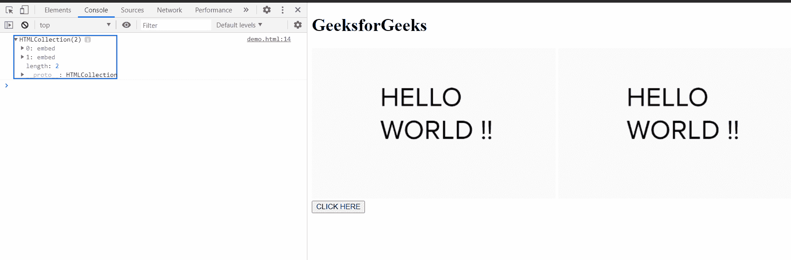

# HTML DOM 文档插件属性

> 原文:[https://www . geesforgeks . org/html-DOM-document-plugins-property/](https://www.geeksforgeeks.org/html-dom-document-plugins-property/)

HTML DOM **插件**属性返回一个 **HTMLCollection** 对象，该对象包含当前文档的一个或多个**嵌入元素**或插件。这是只读属性。

**语法:**

```html
objects = document.plugins
```

**返回值:**

一个 **HTMLCollection** 对象，或者“空”对象，如果文档中没有嵌入的元素或插件。

**示例:**这个示例展示了如何获取文档的插件。

## 超文本标记语言

```html
<!DOCTYPE html>
<html>

<head>
    <title>
        HTML DOM document 
        plugins property
    </title>
</head>

<body>
    <h1>GeeksforGeeks</h1>
    <embed src="hello.PNG">
    <embed src="hello.PNG">
    <br>

    <button onclick="get()">
        CLICK HERE
    </button>

    <script type="text/javascript">
        function get() {
            console.log(document.plugins);
        }
    </script>
</body>

</html>
```

**输出:**

*   **点击按钮前:**
    

*   **点击按钮后:**
    

**支持的浏览器:**

*   谷歌 Chrome
*   微软公司出品的 web 浏览器
*   火狐浏览器
*   歌剧
*   旅行队