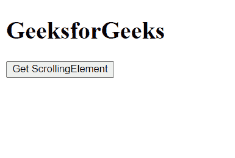
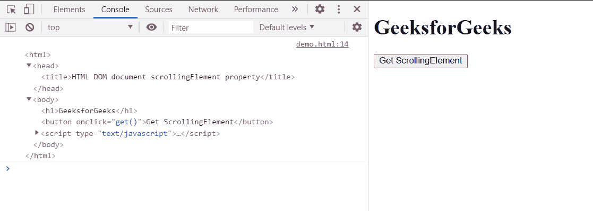

# HTML DOM 文档滚动元素属性

> 原文:[https://www . geesforgeks . org/html-DOM-document-scrollingelelement-property/](https://www.geeksforgeeks.org/html-dom-document-scrollingelement-property/)

文档的**滚动元素**属性返回**对**元素的引用**，该元素滚动**文档。

在**标准模式**下，这是文档的根元素。而在**怪癖模式**中，它返回 HTML 主体元素或空值。

**语法:**

```html
var elem = document.scrollingElement;
```

**返回值:**

*   在**标准**模式下，返回文档的**根元素**。
*   在**怪癖**模式下，它返回 **HTML 主体元素或空。**

**示例:**在本例中，我们使用该属性获取滚动元素。

## 超文本标记语言

```html
<!DOCTYPE html>
<html>

<body>
    <h1>GeeksforGeeks</h1>
    <button onclick="get()">
        Get ScrollingElement
    </button>

    <script type="text/javascript">
        function get() {
            var Elm = document.scrollingElement;
            Elm.scrollTop = 0;
            console.log(Elm)
        }
    </script>
</body>

</html>
```

**输出:**

*   **点击按钮前:**

    

*   **点击按钮后:**

    

**支持的浏览器:**

*   谷歌 Chrome
*   边缘
*   火狐浏览器
*   歌剧
*   旅行队