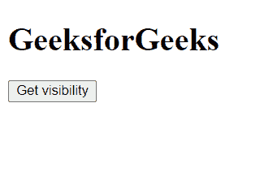
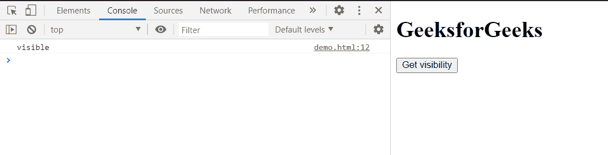

# HTML DOM 文档可见性状态属性

> 原文:[https://www . geesforgeks . org/html-DOM-document-visibility state-property/](https://www.geeksforgeeks.org/html-dom-document-visibilitystate-property/)

**可见性状态**属性返回文档的可见性。这是只读属性。

**语法:**

```html
var vis = document.visibilityState;
```

**返回值:**

*   **可见:**当页面内容可能对用户可见时。
*   **隐藏:**当页面内容对用户不可见时。
*   **预渲染:**当文档被预渲染并且对用户不可见时。

**示例:**

## 超文本标记语言

```html
<!DOCTYPE html>
<html>

<body>
    <h1>GeeksforGeeks</h1>

    <button onclick="get()">
        Get visibility
    </button>

    <script type="text/javascript">
        function get() {
            var m = document.visibilityState;
            console.log(m);
        }
    </script>
</body>

</html>
```

**输出:**

**点击按钮前:**



**点击按钮后:**



**支持的浏览器:**

*   谷歌 Chrome
*   边缘
*   火狐浏览器
*   歌剧
*   旅行队