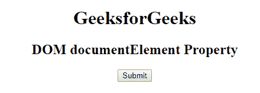
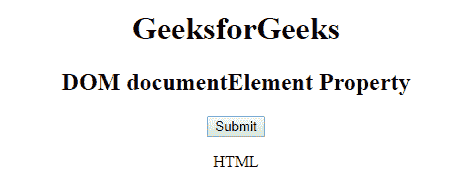

# HTML | DOM documentElement 属性

> 原文:[https://www . geesforgeks . org/html-DOM-document element-property/](https://www.geeksforgeeks.org/html-dom-documentelement-property/)

**DOM 文档元素属性**用于将文档元素作为元素对象返回。它是只读属性。它返回一个< HTML >元素。

**语法:**

```html
document.documentElement 
```

**返回值:**返回文档或元素对象的 documentElement。

下面的程序说明了 HTML 中的 documentElement 属性:

**示例:**

```html
<!DOCTYPE html>
<html>
    <head>
        <title>
            DOM documentElement Property
        </title>

        <script>
            function Geeks() {
                var x = document.documentElement.nodeName;
                document.getElementById("sudo").innerHTML = x;
            }
        </script>
    </head>

    <body>
        <center>
            <h1>GeeksforGeeks</h1>
            <h2>DOM documentElement Property</h2>

            <button onclick = "Geeks()">
                Submit
            </button>

            <p id = "sudo"></p>
        </center>
    </body>
</html>                    
```

**输出:**
**点击按钮前:**

**点击按钮后:**


**支持的浏览器:**T2 DOM document element 属性支持的浏览器如下:

*   谷歌 Chrome
*   微软公司出品的 web 浏览器
*   火狐浏览器
*   歌剧
*   旅行队