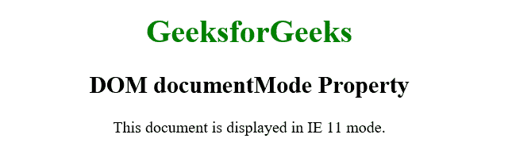

# HTML | DOM documentMode 属性

> 原文:[https://www . geesforgeks . org/html-DOM-document mode-property/](https://www.geeksforgeeks.org/html-dom-documentmode-property/)

HTML 中的 **DOM documentMode 属性**是 IE8 属性，用于检测浏览器渲染当前页面时使用的文档模式。它根据呈现页面的模式返回不同的数字，因为 IE8 可以根据页面的文档类型加上某些 HTML 元素的存在以各种不同的模式呈现页面。

该属性根据我们使用的 IE 版本返回特定的值。

*   如果页面在 IE5 中运行，显示的值将为–5
*   如果页面在 IE7 中运行，显示的值将为–7
*   如果页面在 IE8 中运行，显示的值将为–8

**注意:**默认情况下，页面在 IE5 模式下渲染，如果！未指定 DOCTYPE。
**语法:**

```html
document.documentMode
```

**示例:**

```html
<!DOCTYPE html>
<html>
    <head>
        <title>DOM documentMode Property</title>
    </head>
    <body style = "text-align: center;">
        <h1 style = "color:green;">GeeksforGeeks</h1>
        <h2>DOM documentMode Property</h2>
        This document is displayed in IE 
        <span id="geek"></span> mode.
        <script>
            var docMode = document.documentMode;
            document.getElementById("geek").innerHTML =
                                            docMode;
        </script>
    </body>
</html>                    
```

**输出:**


**支持的浏览器:**document mode 属性仅受 Internet Explorer 支持。