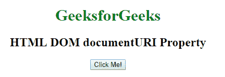
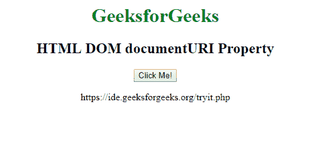

# HTML | DOM documentURI 属性

> 原文:[https://www . geesforgeks . org/html-DOM-document uri-property/](https://www.geeksforgeeks.org/html-dom-documenturi-property/)

HTML DOM 中的 **documentURI 属性**用于设置或返回文档的位置。如果文档是由*文档实现*对象或*未定义*创建的，返回值为空。
*document uri*属性可用于任何文档类型。

**语法:**

*   **返回文档 URI 属性:**

```html
document.documentURI
```

*   **设置 documentURI 属性:**

```html
document.documentURI = locationURI
```

**返回值:**返回一个代表文档网址的字符串值。

**示例:**返回 documentURI 属性:

## 超文本标记语言

```html
<!DOCTYPE html>
<html>

<body>
    <center>
        <h1 style="color:green">GeeksforGeeks</h1>
        <h2>HTML DOM documentURI Property</h2>
        <button onclick="GFGfun()">Click Me!</button>

        <p id="demo"></p>

    </center>
    <script>
        function GFGfun() {
            var v = document.documentURI;
            document.getElementById("demo").innerHTML = v;
        }
    </script>

</body>

</html>
```

**输出:**
**前:**



**之后:**



**支持的浏览器:****HTML DOM documentURI Property**支持的浏览器如下:

*   谷歌 Chrome
*   火狐浏览器
*   苹果 Safari
*   歌剧