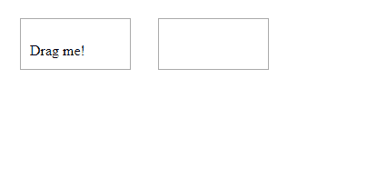
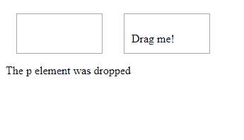
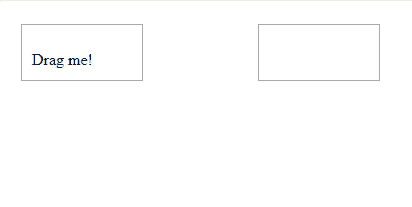
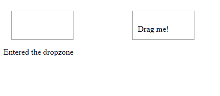

# html \ DOM 拖动事件

> 哎哎哎:# t0]https://www . geeksforgeeks . org/html-DOM-dragevent/

**DOM 拖动事件**是当元素或文本选择被**拖动**或**放下**时发生的事件。这是 HTML5 非常常见的特性。

事件类型:

*   ondrag:拖动元素时发生的事件。
*   ondrop:当拖动的元素放置在指定的放置目标上时发生的事件。
*   ondragenter:当被拖动的元素进入放置目标时发生的事件。
*   ondragleave:当被拖动的元素离开放置目标时发生的事件。
*   ondragover:当拖动的元素在放置目标上时发生事件。

**语法:**

1.  对于 onddragoner 物业:
    *   HTML:

        ```html
        <element ondragenter="script">
        ```

    *   JavaScript:

        ```html
        object.ondragenter = function(){script};
        ```

2.  对于 ondrag 属性:
    *   HTML:

        ```html
        <element ondrag="script">
        ```

    *   JavaScript:

        ```html
        object.ondrag = function(){script};
        ```

3.  对于 ondrop 属性:
    *   HTML:

        ```html
        <element ondrop="script">
        ```

    *   JavaScript:

        ```html
        object.ondrop = function(){script};
        ```

4.  对于 onddragon 物业:
    *   HTML:

        ```html
        <element ondragend="script">
        ```

    *   JavaScript:

        ```html
        object.ondragend = function(){script};
        ```

5.  对于 ondragleave 属性:
    *   HTML:

        ```html
        <element ondragleave ="script">
        ```

    *   JavaScript:

        ```html
        object.ondragleave = function(){script};
        ```

6.  对于 ondragover 属性:
    *   HTML:

        ```html
        <element ondragover="script">
        ```

    *   JavaScript:

        ```html
        object.ondragover = function(){script};
        ```

7.  对于 ondragstart 属性:
    *   HTML:

        ```html
        <element ondragstart="script">
        ```

    *   JavaScript:

        ```html
        object.ondragstart = function(){script};
        ```

**例-1:** ondrag 和 ondrop。

```html
<html>

<head>
    <style> 
        .droptarget {
           /*defining the target with different 
          properties where the element has to
          be dropped*/
            float: left;
            width: 100px;
            height: 35px;
            margin: 15px;
            padding: 10px;
            border: 1px solid #aaaaaa;
        }
    </style>
</head>

<body>
    <div class="droptarget"
         ondrop="drop(event)" 
         ondragover="allowDrop(event)">

        <p ondragstart="dragStart(event)" 
           ondrag="dragging(event)" 
           draggable="true" 
           id="dragtarget">
          Drag me!
      </p>
    </div>

    <div class="droptarget" 
         ondrop="drop(event)"
         ondragover="allowDrop(event)">
  </div>

    <p style="clear:both;">

        <p id="demo">
  </p>

        <script>
            function dragStart(event) {
               // starting dragging
                event.dataTransfer.setData(
                  "Text", event.target.id);
            }

            function dragging(event) {
              // element being dragged
                document.getElementById(
                  "demo").innerHTML = 
                  "The p element is being dragged"; 
            }
            function allowDrop(event) {
                event.preventDefault();
            }

            function drop(event) {
                event.preventDefault();
                // returns the data that is dropped
                var data = event.dataTransfer.getData("Text"); 

                event.target.appendChild(
                  document.getElementById(data));

               //element is being dropped
                document.getElementById("demo").innerHTML =
                  "The p element was dropped";
            }
        </script>

</body>

</html>
```

**输出:**

**拖动前:**


**空投后:**


**例-2:** ondragenter 和 ondragleave。

```html
<!DOCTYPE HTML>
<html>

<head>
    <style>
        .droptarget {
            float: left;
            width: 100px;
            height: 35px;
            margin: 15px;
            margin-right: 100px;
            padding: 10px;
            border: 1px solid #aaaaaa;
        }
    </style>
</head>

<body>

    <div class="droptarget" 
         ondrop="drop(event)" 
         ondragenter="dragEnter(event)" 
         ondragleave="dragLeave(event)" 
         ondragover="allowDrop(event)">

        <p ondragstart="dragStart(event)" 
           draggable="true" 
           id="dragtarget">
          Drag me!
      </p>
    </div>

    <div class="droptarget" 
         ondragenter="dragEnter(event)" 
         ondragleave="dragLeave(event)" 
         ondrop="drop(event)" 
         ondragover="allowDrop(event)">
  </div>

    <p style="clear:both;"></p>
    <p id="demo"></p>

    <script>
        function dragStart(event) { 
            //element being dragged
            event.dataTransfer.setData
            ("Text", event.target.id);
        }

        function dragEnter(event) {
            if (event.target.className == "droptarget") {
                //entering the dropzone
                document.getElementById("demo").innerHTML =
                  "Entered the dropzone"; 
                event.target.style.backgroundColor = 
                  "lightyellow";
            }
        }

        function dragLeave(event) {
            if (event.target.className == "droptarget") {
                //leaving the dropzone
                document.getElementById("demo").innerHTML = 
                  "Left the dropzone"; 
                event.target.style.backgroundColor = "";
            }
        }

        function allowDrop(event) {
            event.preventDefault();
        }

        function drop(event) { 
            // element being dropped
            event.preventDefault();
            event.target.style.backgroundColor = "";
            var data = event.dataTransfer.getData
            ("Text");

            event.target.appendChild(
              document.getElementById(data));
        }
    </script>

</body>

</html>
```

**输出:**
**拖动前:**


**空投后:**


**支持的浏览器:**

*   谷歌 Chrome 4.0
*   Internet Explorer 9.0
*   Mozilla Firefox 3.5
*   Safari 6.0
*   Opera 12.0