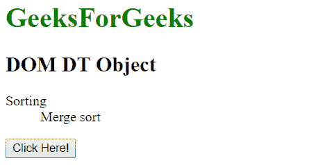
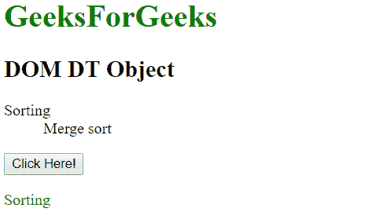
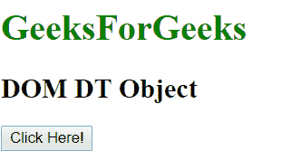
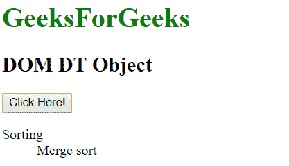

# HTML | DOM DT 对象

> 原文:[https://www.geeksforgeeks.org/html-dom-dt-object/](https://www.geeksforgeeks.org/html-dom-dt-object/)

**DOM dt 对象**用于表示 HTML < dt >元素。可以使用 **getElementById()** 方法访问 dt 元素。

**语法:**

```html
document.getElementById("id"); 
```

其中‘id’是分配给 **dt** 标签的 ID。

**示例-1:**

## 超文本标记语言

```html
<!DOCTYPE html>
<html>
<body>
        <h1 style = "color:green;" >
          GeeksForGeeks
        </h1>

        <h2>DOM DT Object</h2>

        <dl>
            <dt id="id">Sorting</dt>
            <dd>Merge sort</dd>
        </dl>

        <button onclick="Geeks()">Click Here!</button>

        <p id="demo" style="color:green"></p>

        <script>
        function Geeks() {
            var doc = document.getElementById("id").innerHTML;

            document.getElementById("demo").innerHTML = doc;
        }
        </script>
</body>
</html>
```

**输出:**
**点击按钮前:**



**点击按钮后:**



**示例-2:** 可以使用**文档.创建元素**方法创建 DT 对象。

## 超文本标记语言

```html
<!DOCTYPE html>
<html>
<body>
        <h1 style = "color:green;" >
          GeeksForGeeks
        </h1>

        <h2>DOM DT Object</h2>

        <button onclick="Geeks()">Click Here!</button><br>

        <script>
        function Geeks() {
            var doc = document.createElement("DL");
            doc.setAttribute("id", "dl");
            document.body.appendChild(doc);

            // Creating a DT element
            var doc1 = document.createElement("DT");
            var txt1 = document.createTextNode("Sorting");
            doc1.appendChild(txt1);
            doc1.setAttribute("id", "dt");
            document.getElementById("dl").appendChild(doc1);

            // Creating a dd element
            var doc2 = document.createElement("DD");
            var txt2 = document.createTextNode("Merge sort");
            doc2.appendChild(txt2);
            document.getElementById("dl").appendChild(doc2);
        }
        </script>
</body>
</html>
```

**输出:**
**点击按钮前:**



**点击按钮后:**



**支持的浏览器:**

*   谷歌 Chrome
*   Mozilla Firefox
*   边缘
*   旅行队
*   歌剧