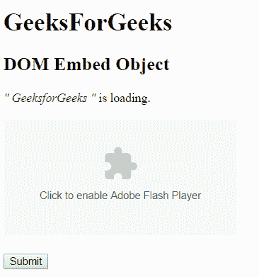

# HTML | DOM 嵌入对象

> 原文:[https://www.geeksforgeeks.org/html-dom-embed-object/](https://www.geeksforgeeks.org/html-dom-embed-object/)

HTML DOM 中的嵌入对象用来表示<embed>元素。使用 getElementById()方法可以访问<embed>元素。

**注意:**这个对象在 HTML 5 中是新的。

**属性值:**

*   **高度:**设置或返回高度属性的值。
*   **src:** 设置或返回嵌入对象的 src 属性值，
*   **类型:**设置或返回嵌入对象的类型属性值。
*   **宽度:**设置或返回嵌入对象的宽度属性值。

**语法:**

```html
document.getElementById("ID"); 
```

其中标识分配给<embed>标签。

**示例 1:** 本示例描述了访问<嵌入>元素的 getElementById()方法。

```html
<!DOCTYPE html> 
<html> 
    <head> 
        <title>
            HTML DOM Embed Object
        </title> 
    </head>

    <body> 
        <h1>GeeksForGeeks</h1>

        <h2>DOM Embed Object</h2>

        <p>
            <q style = "color:green; font-style:italic;">
                GeeksforGeeks
            </q> 
            is loading.
        </p>

        <embed id = "GFG" src = "loading2.swf"
                type="application/x-shockwave-flash"> 

        <br><br> 

        <button onclick = "myGeeks()">Submit</button>

        <p id = "sudo"></p>

        <script>
            function myGeeks() {
                var source = document.getElementById("GFG").src;
                document.getElementById("sudo").innerHTML = source;
            }
        </script>
    </body> 
</html>                                      
```

**输出:**
**点击按钮前:**

点击按钮后:


**示例 2:** 嵌入对象可以使用*文档.创建元素*方法创建。

```html
<!DOCTYPE html> 
<html> 
    <head> 
        <title>
            HTML DOM Embed Object
        </title> 
    </head> 

    <body style="text-align:center"> 

        <h1>GeeksForGeeks</h1>

        <h2>DOM Embed Object</h2>

        <button onclick = "myGeeks()">
            Submit
        </button>

        <p id = "sudo"></p>

        <script>
            function myGeeks() {
                var g = document.createElement("EMBED");
                g.setAttribute("src", "loading2.swf");
                document.body.appendChild(g);
            }
        </script>
    </body> 
</html>                                   
```

**输出:**
**点击按钮前:**

**点击按钮后:**


**支持的浏览器:***DOM 嵌入对象*支持的浏览器如下:

*   谷歌 Chrome
*   微软公司出品的 web 浏览器
*   火狐浏览器
*   歌剧
*   旅行队