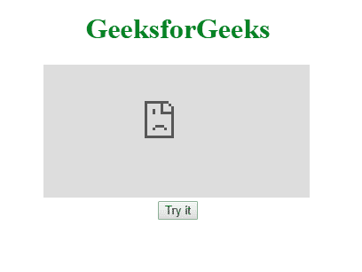

# HTML | DOM 嵌入 src 属性

> 原文:[https://www.geeksforgeeks.org/html-dom-embed-src-property/](https://www.geeksforgeeks.org/html-dom-embed-src-property/)

**HTML DOM 嵌入 src 属性**用于设置或返回嵌入元素中 src 属性的值。该属性指定要嵌入的外部文件的地址。

**语法:**

*   **返回 src 属性:**

    ```html
    embedObject.src
    ```

*   **设置 src 属性:**

    ```html
    embedObject.src = URL
    ```

**属性值:**

*   **URL:** 指定要嵌入的外部文件的 URL。
    **可能值:**

*   绝对网址:指向另一个网站
*   相对网址:指向网站内的文件。

**返回值:**代表嵌入文件的网址的字符串。返回带有协议的整个网址。

**示例:**

```html
<!DOCTYPE html>
<html>

<head>
    <title>HTML DOM Embed src Property</title>
</head>

<body>
    <center>
        <h1 style="color:green">
          GeeksforGeeks
      </h1>
        <embed id="embedID" 
               src="https://ide.geeksforgeeks.org">
        <br>
        <button onclick="GFGfun()">
          Try it
      </button>

        <p id="pid"></p>

        <script>
            function GFGfun() {
                var idsrc = document.getElementById("embedID").src;
                document.getElementById("pid").innerHTML = idsrc;
            }
        </script>
    </center>
</body>

</html>
```

**输出:**


**支持的浏览器:****HTML DOM Embed src Property**支持的浏览器如下:

*   谷歌 Chrome
*   微软公司出品的 web 浏览器
*   火狐浏览器
*   苹果 Safari
*   歌剧