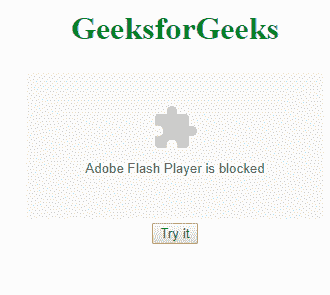
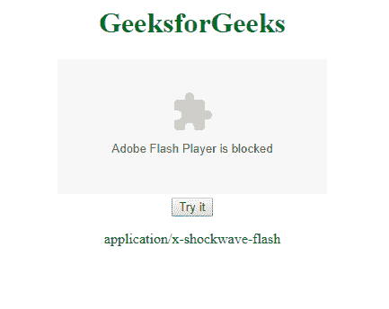

# HTML | DOM 嵌入类型属性

> 原文:[https://www.geeksforgeeks.org/html-dom-embed-type-property/](https://www.geeksforgeeks.org/html-dom-embed-type-property/)

HTML 中的 **DOM 嵌入高度属性**用于设置或返回嵌入元素中类型属性的值。类型属性指定嵌入内容的 MIME 类型。

**语法:**

*   **返回类型属性:**

    ```html
    embedObject.type
    ```

*   **设置类型属性:**

    ```html
    embedObject.type = MIME_type
    ```

**属性值:**

*   **MIME_type:** 包含单值 MIME-type，用于指定目标网址。

**返回值:**返回一个字符串值，代表链接文档的 MIME 类型。

**示例:**

```html
<!DOCTYPE html>
<html>

<head>
    <title>HTML DOM Embed type Property</title>
</head>

<body>
    <center>
        <h1 style="color:green"> 
            GeeksforGeeks 
        </h1>

        <embed id="embedID"
               type="application/x-shockwave-flash" 
               src="https://ide.geeksforgeeks.org">
        <br>

        <button onclick="GFGfun()">
            Try it
        </button>

        <p id="pid"></p>

        <script>
            function GFGfun() {
                var idtype = 
                document.getElementById("embedID").type;

                document.getElementById("pid").innerHTML
                        = idtype;
            }
        </script>
    </center>
</body>

</html>
```

**输出:**
**点击按钮前:**

**点击按钮后:**


**支持的浏览器:****DOM 嵌入类型属性**支持的浏览器如下:

*   谷歌 Chrome
*   微软公司出品的 web 浏览器
*   火狐浏览器
*   苹果 Safari
*   歌剧