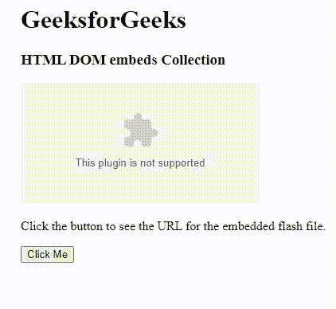
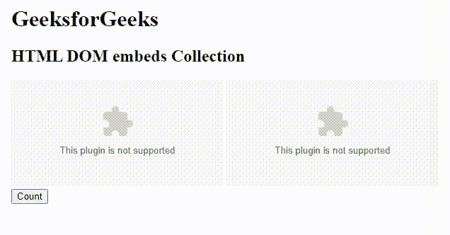

# HTML DOM 嵌入集合

> 原文:[https://www.geeksforgeeks.org/html-dom-embeds-collection/](https://www.geeksforgeeks.org/html-dom-embeds-collection/)

**示例:**这个示例演示了使用 DOM embedded 集合来获取嵌入式 flash 文件的 URL。

## 超文本标记语言

```html
<!DOCTYPE html>
<html>
<body>
    <h1>GeeksforGeeks</h1>
    <h3>HTML DOM embeds Collection</h3>
    <embed id="gfgEmbed" src="gfg.swf">
    <p>
        Click the button to see the URL for the embedded flash file.
    </p>

    <button onclick="gfg()">Click Me</button>
    <p id="show"></p>

    <script>
    function gfg() {
        var g = document.getElementById("gfgEmbed").src;
        document.getElementById("show").innerHTML = "URL: " + g;
    }
    </script>
</body>
</html>
```

**输出:**



**DOM 嵌入集合属性**用于返回所有嵌入元素的集合。集合中的元素按出现在源代码中的顺序排列。此属性用于只读。

**语法:**

```html
document.embeds
```

**属性:**该属性包含一个返回文档中元素数量的值长度。

**方法:**DOM 嵌入集合包含三种方法，如下所示:

*   **【索引】:**用于返回所选索引的元素。索引值以 0 开始。如果索引值超出范围，则返回空值。
*   **项(索引):**用于返回所选索引的<嵌入>元素。索引值以 0 开始。如果索引值超出范围，则返回空值。
*   **namedItem(id):** 用于返回集合中给定 id 属性的<嵌入>元素。如果 id 无效，它将返回 NULL。

**返回值:**一个 HTMLCollection 对象，代表文档中嵌入的所有<>元素。集合中的元素在源代码中出现时进行排序

**接受的属性:**

*   [HTML DOM 嵌入宽度属性](https://www.geeksforgeeks.org/html-dom-embed-width-property/):用于设置或返回宽度属性的值。
*   [HTML DOM 嵌入类型属性](https://www.geeksforgeeks.org/html-dom-embed-type-property/):用于设置或返回嵌入元素中类型属性的值。
*   [HTML DOM 嵌入 src 属性](https://www.geeksforgeeks.org/html-dom-embed-src-property/):用于设置或返回嵌入元素中 src 属性的值。
*   [HTML DOM 嵌入高度属性](https://www.geeksforgeeks.org/html-dom-embed-height-property/):用于设置或返回高度属性的值。

**示例:**这个示例演示了使用 DOM embeddeds 集合来获取 embedded 元素的总数。

## 超文本标记语言

```html
<!DOCTYPE html>
<html>
<head>
    <title>DOM embeds Collection</title>
</head>

<body>
    <h1>GeeksforGeeks</h1>
    <h2>HTML DOM embeds Collection</h2>
    <embed src="geeksforgeeks.swf">
    <embed src="geeksforgeeks.swf">
    <button onclick="geeks()">Count</button>
    <p id="cnt"></p>

    <script>
    function geeks() {
        var x = document.embeds.length;
        document.getElementById("cnt").innerHTML = 
          "Number of embed Element is:" + x;
    }
    </script>
</body>
</html>
```

**输出:**



**支持的浏览器:**

*   谷歌 Chrome 93.0 及以上
*   Internet Explorer 11.0
*   微软边缘 93.0
*   火狐 92.0 及以上版本
*   Opera 79.0
*   Safari 14.1