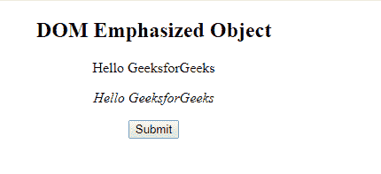
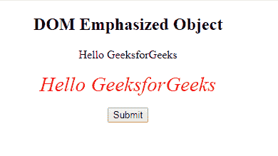
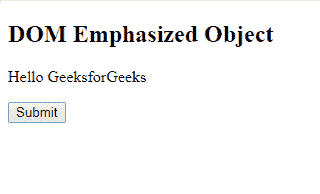
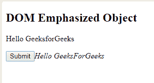

# HTML | DOM 强调对象

> 原文:[https://www.geeksforgeeks.org/html-dom-emphasized-object/](https://www.geeksforgeeks.org/html-dom-emphasized-object/)

**DOM 强调对象**用于表示 HTML < em >元素。getElementById()访问强调元素。
**语法:**

```html
document.getElementById("ID");
```

其中“id”是分配给**“em”**标签的 ID。

**示例-1:**

```html
<!DOCTYPE html>
<html>

<head>
    <title>DOM Emphasized Object</title>
</head>

<body>
    <center>
        <h2>DOM Emphasized Object</h2>

        <!--Text in Italics-->
        <p>Hello GeeksforGeeks</p>

        <!--Text in Emphasize-->
        <p><em id="GFG">Hello GeeksforGeeks</em></p>

        <button onclick="mygeeks()">
          Submit
        </button>

            <script>
                function mygeeks() {
                    var gfg = document.getElementById("GFG");
                    gfg.style.color = "red";
                    gfg.style.fontSize = "29px";
                }
            </script>
  </center>
</body>

</html>
```

**输出:**

**点击按钮前:**


**点击按钮后:**


**示例-2 :**

```html
<!DOCTYPE html>
<html>

<head>
    <title>DOM Emphasized Object</title>
</head>

<body>
    <h2>DOM Variable Object</h2>

    <!--Text in Paragraph-->
    <p>Hello GeeksforGeeks</p>

    <button onclick="mygeeks()">
      Submit
    </button>

        <script>
            function mygeeks() {
                var gfg = document.createElement("em");
                var text = 
                document.createTextNode("Hello GeeksForGeeks");
                gfg.appendChild(text);

                document.body.appendChild(gfg);
            }
        </script>
</body>

</html>
```

**输出:**

**点击按钮前:**


**点击按钮后:**


**支持的浏览器:****DOM 强调对象**支持的浏览器如下:

*   谷歌 Chrome
*   微软公司出品的 web 浏览器
*   火狐浏览器
*   歌剧
*   旅行队