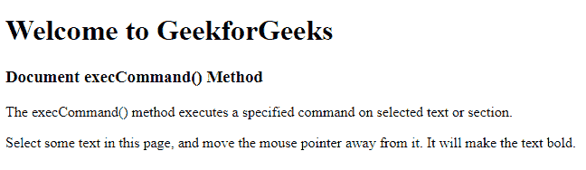
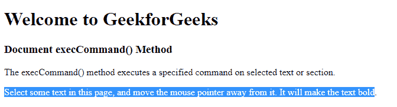
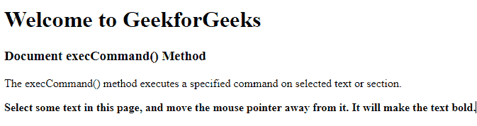

# HTML | DOM execCommand()方法

> 原文:[https://www.geeksforgeeks.org/html-dom-execcommand-method/](https://www.geeksforgeeks.org/html-dom-execcommand-method/)

HTML DOM 中的 **DOM execCommand()** 方法用于执行用户在可编辑的选中部分指定的命令。

**语法:**

```html
document.execCommand( command, showUI, value )
```

**参数:**该方法接受下列三个参数:

*   **命令:**该参数保存在所选部分执行的命令的名称。HTML 中的命令有很多，其中有:*反白*、*加粗*、*复制*、*剪切*、*删除*等。
*   **显示界面:**保存指示界面是否显示的布尔值。
*   **值:**该参数保存命令的值。

**返回值:**返回布尔值。如果支持该命令，则返回真，否则返回假。

**示例:**

```html
<!DOCTYPE html>
<html>
    <head>
        <title>
            HTML DOM execCommand() Method
        </title>

        <!--script to make text bold-->
        <script>
            document.designMode = "on";

            function execfunction(event) {
                document.execCommand("bold");
            }
        </script>
    </head>

    <!--onmouseout event when the user moves the mouse 
    pointer after selecting, this execfunction()
    will execute.-->
    <body onmouseout = "execfunction(event)">

        <h1>
            Welcome to GeekforGeeks
        </h1>

        <h3>
            Document execCommand() Method
        </h3>

        <p>
            The execCommand() method executes a specified 
            command on selected text or section.
        </p>

        <p>
            Select some text in this page, and move the mouse
            pointer away from it. It will make the text bold.
        </p>
    </body>
</html>                    
```

**输出:**
**选择内容前:**

**选择内容后:**

**移动鼠标指针后:**


**支持的浏览器:**下面列出了 *DOM execCommand()方法*支持的浏览器:

*   铬
*   Internet Explorer 9.0
*   Opera 29.0
*   Firefox 41.0
*   苹果 Safari 20.0