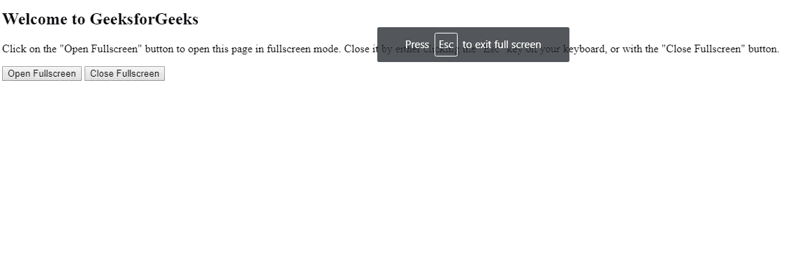
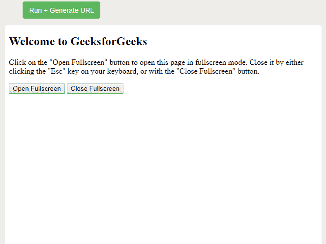

# HTML | DOM exitfulscreen()方法

> 原文:[https://www . geesforgeks . org/html-DOM-exitfulscreen-method/](https://www.geeksforgeeks.org/html-dom-exitfullscreen-method/)

**exitFullscreen()** 方法请求将当前处于全屏模式的元素从全屏模式中取出。如果元素没有处于全屏模式，那么什么都不会改变。这个方法的反过来就是**请求全屏()**。

**语法:**

```html
HTMLElementObject.exitFullscreen()

```

**参数:**不需要参数。

**返回值:**无返回值。

**示例:**

```html
<!DOCTYPE html>
<html>

<head>
    <title>
      HTML | DOM exitFullscreen() Method
    </title>

    <!--script for close and open fullscreen-->
    <script>
        var elem = document.documentElement;

        function closeFullscreen() {
            if (document.exitFullscreen)
                document.exitFullscreen();
        }

        function openFullscreen() {
            if (elem.requestFullscreen)
                elem.requestFullscreen();
        }
    </script>
</head>

<body>

    <h2>Welcome to GeeksforGeeks</h2>
    <p>
      Click on the "Open Fullscreen" button to open this page in" 
      + "fullscreen mode. Close it by either clicking the "Esc" key"
      +" on your keyboard, or with the "Close Fullscreen" button.
    </p>

    <button onclick="openFullscreen();">
      Open Fullscreen
    </button>
    <button onclick="closeFullscreen();">
      Close Fullscreen
    </button>

</body>

</html>
```

**输出:**
**开启全屏**

**退出全屏**


**支持的浏览器:**DOM**exitfulscreen()**方法支持的浏览器如下:

*   谷歌 Chrome
*   微软公司出品的 web 浏览器
*   火狐浏览器
*   歌剧
*   旅行队