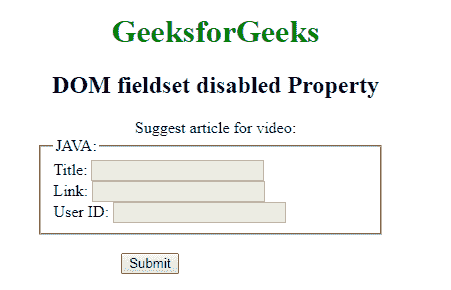
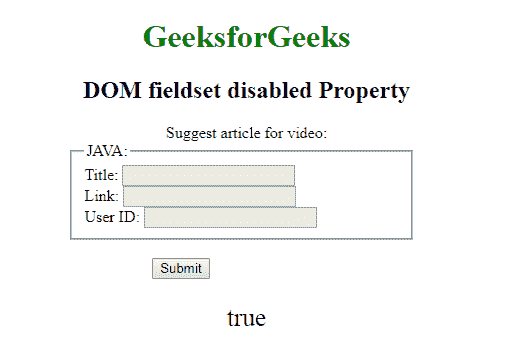
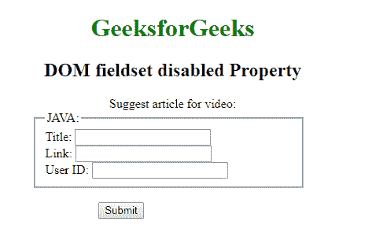

# HTML | DOM 字段集禁用属性

> 原文:[https://www . geesforgeks . org/html-DOM-field set-disabled-property/](https://www.geeksforgeeks.org/html-dom-fieldset-disabled-property/)

HTML DOM 中的**字段集禁用属性**用于**设置**或**返回**一个字段集是否禁用。禁用的元素不可用且不可点击，默认情况下通常呈现灰色。此属性用于反映 HTML 禁用属性。

**语法:**

*   **返回禁用属性:**

    ```html
    fieldsetObject.disabled
    ```

*   **用于设置禁用属性:**

    ```html
    fieldsetObject.disabled = true|false 
    ```

**属性值:**

*   **真:**字段集被禁用。
*   **false:** 有默认值。字段集未被禁用。

**返回值:**返回一个布尔值，表示字段集是否被禁用。

**示例-1:** 本示例返回禁用的属性。

```html
<!DOCTYPE html>
<html>

<head>
    <title>
      DOM fieldset disabled Property
  </title>
    <style>
        h1,
        h2,
        .title {
            text-align: center;
        }

        fieldset {
            width: 50%;
            margin-left: 22%;
        }

        h1 {
            color: green;
        }

        button {
            margin-left: 35%;
        }
    </style>
</head>

<body>
    <h1>
      GeeksforGeeks
  </h1>
    <h2>
      DOM fieldset disabled Property
  </h2>

    <form>
        <div class="title">
            Suggest article for video:
      </div>

        <fieldset id="GFG" disabled>
            <legend>JAVA:</legend>
            Title:
            <input type="text">
            <br> Link:
            <input type="text">
            <br> User ID:
            <input type="text">
        </fieldset>

    </form>
    <br>

    <button onclick="Geeks()">
      Submit
  </button>
    <p id="sudo" 
       style="font-size:25px;
              text-align:center;">
  </p>
    <script>
        function Geeks() {
            var g = 
                document.getElementById(
                  "GFG").disabled;

            document.getElementById(
              "sudo").innerHTML = g;
        }
    </script>
</body>

</html>
```

**输出:**

**点击按钮前:**


**点击按钮后:**


**示例-2:** 本示例设置禁用属性。

```html
<!DOCTYPE html>
<html>

<head>
    <title>
      DOM fieldset disabled Property
  </title>
    <style>
        h1,
        h2,
        .title {
            text-align: center;
        }

        fieldset {
            width: 50%;
            margin-left: 22%;
        }

        h1 {
            color: green;
        }

        button {
            margin-left: 35%;
        }
    </style>
</head>

<body>
    <h1>
      GeeksforGeeks
  </h1>
    <h2>
      DOM fieldset disabled Property
  </h2>

    <form>
        <div class="title">
            Suggest article for video:
      </div>

        <fieldset id="GFG">
            <legend>JAVA:</legend>
            Title:
            <input type="text">
            <br> Link:
            <input type="text">
            <br> User ID:
            <input type="text">
        </fieldset>

    </form>
    <br>

    <button onclick="Geeks()">
      Submit
  </button>
    <script>
        function Geeks() {
            var g = 
                document.getElementById("GFG");

            /* check the fieldset 
            is disable or not */
            g.disabled = true;

            /* name property of fieldset*/
            g.name;
        }
    </script>
</body>

</html>
```

**输出:**
**点击按钮前:**


**点击按钮后:**


**支持的浏览器:**T2 DOM field set 禁用属性支持的浏览器如下:

*   谷歌 Chrome
*   Internet Explorer 10.0 +
*   火狐浏览器
*   歌剧
*   旅行队