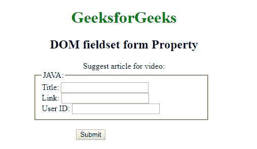
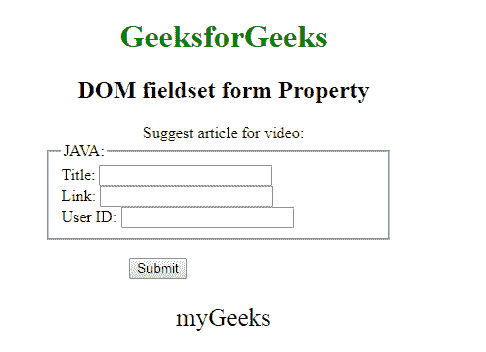

# HTML | DOM Fieldset 表单属性

> 原文:[https://www . geesforgeks . org/html-DOM-field set-form-property/](https://www.geeksforgeeks.org/html-dom-fieldset-form-property/)

HTML DOM 中的**字段集表单属性**用于设置或返回对包含<字段集>元素的表单的引用。它是只读属性，在成功时返回表单对象。

**语法:**

```html
fieldsetObject.form 
```

下面的程序说明了在 HTML DOM 中使用 DOM Fieldset 表单属性:

**示例:**本示例返回字段集表单属性。

```html
<!DOCTYPE html> 
<html> 

<head> 
    <title>
        DOM fieldset form Property
    </title> 

    <style> 
        h1, h2, .title { 
            text-align: center; 
        } 
        fieldset { 
            width: 50%; 
            margin-left: 22%; 
        } 
        h1 { 
            color: green; 
        } 
        button { 
            margin-left: 35%; 
        } 
    </style> 
</head> 

<body> 
    <h1>GeeksforGeeks</h1> 
    <h2>DOM fieldset form Property</h2> 

    <form id="myGeeks"> 
        <div class="titl"> 
            Suggest article for video:
        </div> 

        <fieldset id="GFG"> 
            <legend>JAVA:</legend> 
            Title: <input type="text"><br> 
            Link: <input type="text"><br>
            User ID: <input type="text"> 
        </fieldset> 
    </form><br> 

    <button onclick="Geeks()">Submit</button> 
    <p id="sudo" style="font-size:25px;text-align:center;"></p>

    <!-- Script to use DOM fieldset form Property -->
    <script> 
        function Geeks() { 
            var g = document.getElementById("GFG").form.id;
            document.getElementById("sudo").innerHTML = g;
        } 
    </script> 
</body> 

</html>                    
```

**输出:**

*   **点击按钮前:**
    
*   **点击按钮后:**
    

**支持的浏览器:**T2 DOM field set 表单属性支持的浏览器如下:

*   谷歌 Chrome
*   微软公司出品的 web 浏览器
*   火狐浏览器
*   歌剧
*   旅行队