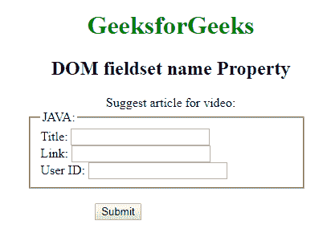
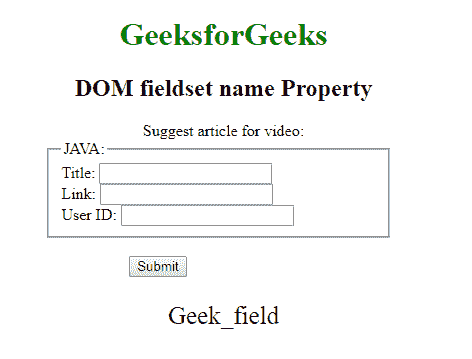
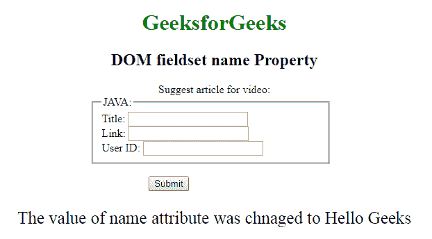

# HTML | DOM 字段集名称属性

> 原文:[https://www . geesforgeks . org/html-DOM-field set-name-property/](https://www.geeksforgeeks.org/html-dom-fieldset-name-property/)

HTML DOM 中的**字段集名称属性**用于设置或返回字段集元素的名称属性值。name 属性用于指定 fieldset 字段的名称。如果没有在输入字段中指定 name 属性，则根本不会发送该字段的数据。

**语法:**

*   它返回字段集名称属性。

    ```html
    fieldsetObject.name
    ```

    *   It is used to set the Fieldset name property.

    ```html
    fieldsetObject.name = name
    ```

    **属性值:**包含单个值**名称**，用于指定字段集元素的名称。

    **返回值:**返回一个代表 Fieldset 元素名称的字符串值。

    **示例 1:** 本示例返回 Fieldset 名称属性。

    ```html
    <!DOCTYPE html> 
    <html> 

    <head> 
        <title>
            DOM fieldset name Property
        </title> 

        <style> 
            h1, h2, .title { 
                text-align: center; 
            } 
            fieldset { 
                width: 50%; 
                margin-left: 22%; 
            } 
            h1 { 
                color: green; 
            } 
            button { 
                margin-left: 35%; 
            } 
        </style> 
    </head> 

    <body> 
        <h1>GeeksforGeeks</h1> 
        <h2>DOM fieldset name Property</h2> 

        <form id="myGeeks"> 
            <div class="titl"> 
                Suggest article for video:
            </div> 

            <fieldset id="GFG" name="Geek_field"> 
                <legend>JAVA:</legend> 
                Title: <input type="text"><br> 
                Link: <input type="text"><br>
                User ID: <input type="text"> 
            </fieldset> 
        </form><br> 

        <button onclick="Geeks()">Submit</button> 

        <p id="sudo" style="font-size:25px;text-align:center;"></p>

        <!-- Script to use DOM fieldset name Property -->
        <script> 
            function Geeks() { 
                var g = document.getElementById("GFG").name;
                document.getElementById("sudo").innerHTML = g;
            } 
        </script> 
    </body> 

    </html>                    
    ```

    **输出:**

    *   **点击按钮前:**
        
    *   **点击按钮后:**
        

    **示例 2:** 本示例设置字段集名称属性。

    ```html
    <!DOCTYPE html> 
    <html> 

    <head> 
        <title>
            DOM fieldset name Property
        </title> 

        <style> 
            h1, h2, .title { 
                text-align: center; 
            } 
            fieldset { 
                width: 50%; 
                margin-left: 22%; 
            } 
            h1 { 
                color: green; 
            } 
            button { 
                margin-left: 35%; 
            } 
        </style> 
    </head> 

    <body> 
        <h1>GeeksforGeeks</h1> 
        <h2>DOM fieldset name Property</h2> 

        <form id="myGeeks"> 
            <div class="titl"> 
                Suggest article for video:
            </div> 

            <fieldset id="GFG" name="Geek_field"> 
                <legend>JAVA:</legend> 
                Title: <input type="text"><br>
                Link: <input type="text"><br> 
                User ID: <input type="text"> 
            </fieldset> 
        </form><br> 

        <button onclick="Geeks()">Submit</button> 
        <p id="sudo" style="font-size:25px;text-align:center;"></p>

        <!-- Script to use DOM fieldset name Property -->
        <script> 
            function Geeks() { 
                var g = document.getElementById("GFG").name
                        = "Hello Geeks";

                document.getElementById("sudo").innerHTML
                        = "The value of name attribute was "
                        + "chnaged to " + g;
            } 
        </script> 
    </body> 

    </html>                    
    ```

    **输出:**

    *   **点击按钮前:**
        
    *   **点击按钮后:**
        

    **支持的浏览器:****DOM field set 名称属性**支持的浏览器如下:

    *   谷歌 Chrome
    *   火狐浏览器
    *   歌剧