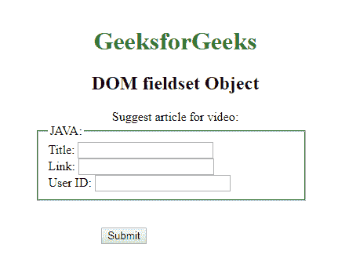
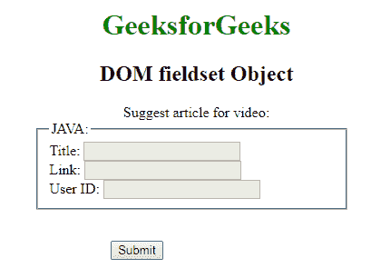
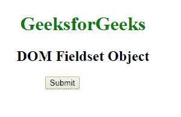
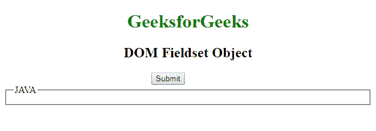

# HTML | DOM 字段集对象

> 原文:[https://www.geeksforgeeks.org/html-dom-fieldset-object/](https://www.geeksforgeeks.org/html-dom-fieldset-object/)

**DOM 字段集对象**用于表示 HTML [<字段集>](https://www.geeksforgeeks.org/?p=252085) 元素。通过 **getElementById()** 访问字段集元素。

**属性:**

*   **禁用:** *禁用*属性用于设置或返回字段集是否被禁用。
*   **表单:** *用于返回对包含字段集的表单的引用。*
*   ***名称:**字段名称属性的值由*名称*设置或返回。*
*   ***类型:**返回表单的类型。*

***语法:***

```html
*document.getElementById("ID");*
```

*其中“id”是分配给**“field set”**标签的 ID。*

***示例-1:***

```html
*<!DOCTYPE html>
<html>

<head>
    <title>fieldset tag</title>
    <style>
        h1,
        h2,
        .title {
            text-align: center;
        }

        fieldset {
            width: 50%;
            margin-left: 22%;
        }

        h1 {
            color: green;
        }

        button {
            margin-left: 35%;
        }
    </style>
</head>

<body>
    <h1>GeeksforGeeks</h1>
    <h2>DOM fieldset Object</h2>

    <form>
        <div class="titl">
          Suggest article for video:</div>

        <fieldset id="GFG">
            <legend>JAVA:</legend>
            Title:
            <input type="text">
            <br> Link:
            <input type="text">
            <br> User ID:
            <input type="text">
        </fieldset>

    </form>
    <br>

    <button onclick="Geeks()">Submit</button>
    <script>
        function Geeks() {
            var g = document.getElementById("GFG");

            <!-- check the fieldset is disable or not -->
            g.disabled = true;

            <!-- name property of fieldset -->
            g.name;
        }
    </script>
</body>

</html>*
```

***输出:***

***点击按钮前:**
*

***:点击**
按钮后*

***示例-2:** 可以使用**文档.创建元素**方法创建字段集对象。*

```html
*<!DOCTYPE html>
<html>

<head>
    <title>DOM Fieldset Object</title>
    <style>
        h1,
        h2 {
            text-align: center;
        }

        h1 {
            color: green;
        }

        button {
            margin-left: 40%;
        }

        details {
            font-size: 30px;
            color: green;
            text-align: center;
            margin-top: 30px;
        }
    </style>
</head>

<body>
    <h1>GeeksforGeeks</h1>
    <h2>DOM Fieldset Object</h2>
    <button onclick="myGeeks()">Submit</button>

    <script>
        function myGeeks() {
            var g = document.createElement("FIELDSET");
            g.setAttribute("id", "GFG");
            document.body.appendChild(g);

            var f = document.createElement("LEGEND");
            var text = document.createTextNode("JAVA");
            f.appendChild(text);

            document.getElementById("GFG").appendChild(f);

        }
    </script>
</body>

</html> *
```

***点击按钮前:**
*

***点击按钮后:**
*

***支持的浏览器:****DOM field set 对象**支持的浏览器如下:*

*   *谷歌 Chrome*
*   *微软公司出品的 web 浏览器*
*   *火狐浏览器*
*   *歌剧*
*   *旅行队*