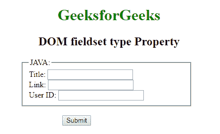
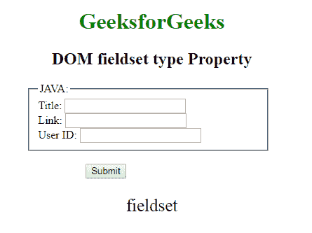

# HTML | DOM 字段集类型属性

> 原文:[https://www . geesforgeks . org/html-DOM-field set-type-property/](https://www.geeksforgeeks.org/html-dom-fieldset-type-property/)

HTML DOM 中的 **DOM 字段集类型属性**用于**设置**或**返回** *字段集是哪种类型的表单元素。它是一个只读属性，将始终返回**“field set”**。*

**语法:**

```html
fieldsetObject.type
```

**下面的程序说明了字段集属性的使用。**

**示例:**本示例返回类型属性。

```html
<!DOCTYPE html>
<html>

<head>
    <title>
      DOM fieldset type Property 
  </title>
    <style>
        h1,
        h2,
        .titl {
            text-align: center;
        }

        fieldset {
            width: 50%;
            margin-left: 22%;
        }

        h1 {
            color: green;
        }

        button {
            margin-left: 35%;
        }
    </style>
</head>

<body>
    <h1>GeeksforGeeks</h1>
    <h2>
      DOM fieldset type Property
  </h2>

    <form>

        <fieldset id="GFG">
            <legend>JAVA:</legend>
            Title:
            <input type="text">
            <br> Link:
            <input type="text">
            <br> User ID:
            <input type="text">
        </fieldset>

    </form>
    <br>

    <button onclick="Geeks()">
      Submit
  </button>
    <p id="sudo" 
       style="font-size:25px;
              text-align:center;">
  </p>
    <script>
        function Geeks() {
            var g = 
                document.getElementById(
                  "GFG").type;

            document.getElementById(
              "sudo").innerHTML = g;

        }
    </script>
</body>

</html>
```

**输出:**
**点击按钮前:**

**点击按钮后:**


**支持的浏览器:**T2 DOM 字段集类型属性支持的浏览器如下:

*   谷歌 Chrome
*   微软公司出品的 web 浏览器
*   火狐浏览器
*   歌剧
*   旅行队