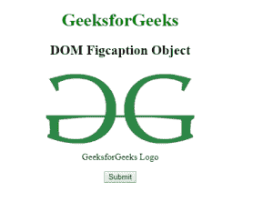
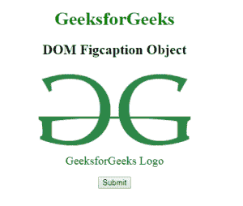
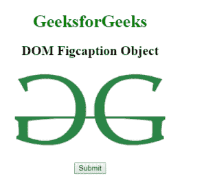
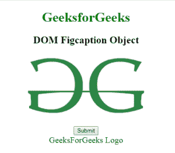

# HTML | DOM Figcaption 对象

> 原文:[https://www.geeksforgeeks.org/html-dom-figcaption-object/](https://www.geeksforgeeks.org/html-dom-figcaption-object/)

HTML DOM 中的 Figcaption 对象用来表示 HTML figcaption 元素。getElementById()访问 figcaption 元素。

**语法:**

```html
document.getElementById("ID");
```

其中标识代表元素标识。

**例 1:**

```html
<!DOCTYPE html> 
<html> 
    <head> 
        <title>
            HTML DOM figcaption Object
        </title> 

        <style> 
            body { 
                text-align:center; 
            } 
            h1 { 
                color:green; 
            } 
        </style> 
    </head> 

    <body> 
        <h1>GeeksforGeeks</h1> 

        <h2>DOM Figcaption Object</h2> 

        <figure> 
             

            <figcaption id = "GFG">
                GeeksforGeeks Logo
            </figcaption> 
        </figure>

        <button onclick = "Geeks()">
            Submit
        </button>

        <script>
        function Geeks() {
            var gfg = document.getElementById("GFG");
            gfg.style.color = "green";
            gfg.style.fontSize = "20px";
        }
        </script> 
    </body> 
</html>                                                     
```

**输出:**
**点击按钮前:**

**点击按钮后:**


**示例 2:** 可以使用*文档创建元素方法创建图形标题对象。*

```html
<!DOCTYPE html> 
<html> 
    <head> 
        <title>
            HTML DOM figcaption Object
        </title> 
        <style> 
            body { 
                text-align:center; 
            } 
            h1 { 
                color:green; 
            } 
        </style> 
    </head>

    <body> 
        <h1>GeeksforGeeks</h1> 
        <h2>DOM Figcaption Object</h2> 

        <figure> 
            
        </figure> 

        <button onclick = "Geeks()">
            Submit
        </button>

        <!-- script to add figcaption object -->
        <script>
            function Geeks() {
                var x = document.createElement("FIGCAPTION");
                var y = document.createTextNode("GeeksForGeeks Logo")
                x.appendChild(y);
                x.style.color = "green";
                document.body.appendChild(x);
            }
        </script>
    </body> 
</html>                                            
```

**点击按钮前:**

**点击按钮后:**


**支持的浏览器:***DOM fig caption Object*支持的浏览器如下:

*   谷歌 Chrome
*   微软公司出品的 web 浏览器
*   火狐浏览器
*   歌剧
*   旅行队