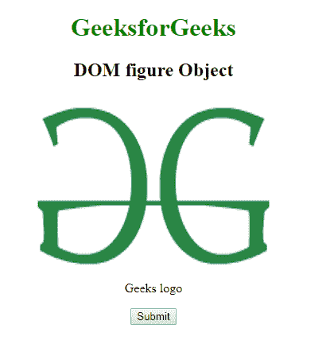
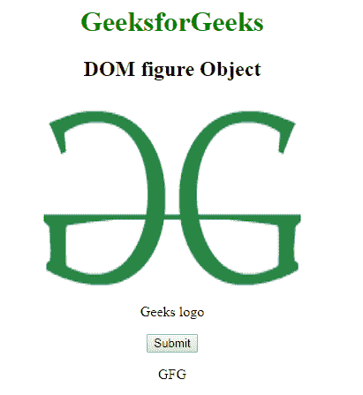
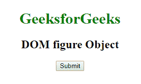
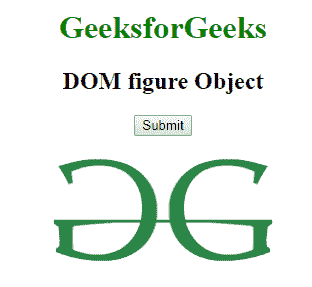

# HTML | DOM 图对象

> 原文:[https://www.geeksforgeeks.org/html-dom-figure-object/](https://www.geeksforgeeks.org/html-dom-figure-object/)

**DOM 图形对象**用于表示 HTML [<图形>](https://www.geeksforgeeks.org/html5-figure-tag/) 元素。图形元素由 **getElementById()** 访问。

**语法:**

```html
document.getElementById("ID");
```

其中“id”是分配给**“图”**标签的 ID。

**示例-1:**

```html
<!DOCTYPE html>
<html>

<head>
    <title>figure tag</title>
    <style>
        body {
            text-align: center;
        }

        h1 {
            color: green;
        }
    </style>
</head>

<body>
    <h1>GeeksforGeeks</h1>
    <h2>DOM figure Object</h2>

    <!-- assign id to figure tag --> 
    <figure id="GFG">

        

        <figcaption>Geeks logo</figcaption>
    </figure>

    <button onclick="Geeks()">Submit</button>
    <p id="sudo"></p>

    <script>
        function Geeks() {

          <!-- accessing the figure object -->
            var g = 
            document.getElementById("GFG").id;

            document.getElementById("sudo").innerHTML = g;
        }
    </script>
</body>

</html>               
```

**输出:**

**点击按钮前:**


**点击按钮后:**


**示例-2:** 可以使用**文档.创建元素**方法创建图形对象。

```html
<!DOCTYPE html>
<html>

<head>
    <title>figure tag</title>
    <style>
        body {
            text-align: center;
        }

        h1 {
            color: green;
        }
    </style>
</head>

<body>
    <h1>GeeksforGeeks</h1>
    <h2>DOM figure Object</h2>

    <button onclick="Geeks()">Submit</button>

    <script>
        function Geeks() {

            var g = document.createElement("FIGURE");
            g.setAttribute("id", "GFG");
            document.body.appendChild(g);

            var f = document.createElement("IMG");
            f.setAttribute("src", 
"https://media.geeksforgeeks.org/wp-content/uploads/geeks-25.png");
            f.setAttribute("width", "304");
            f.setAttribute("width", "228");
            f.setAttribute("alt", "GeeksforGeeks");

            document.getElementById("GFG").appendChild(f);
        }
    </script>
</body>

</html>
```

**输出:**

**点击按钮前:**


**点击按钮后:**


**支持的浏览器:****DOM 图对象**支持的浏览器如下:

*   谷歌 Chrome
*   微软公司出品的 web 浏览器
*   火狐浏览器
*   歌剧
*   旅行队