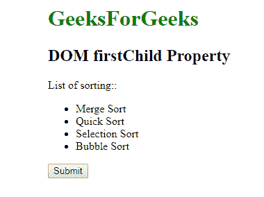
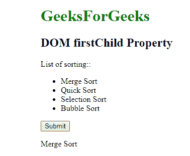
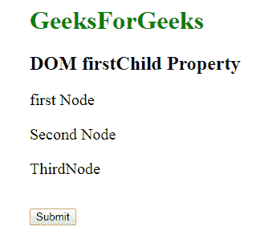
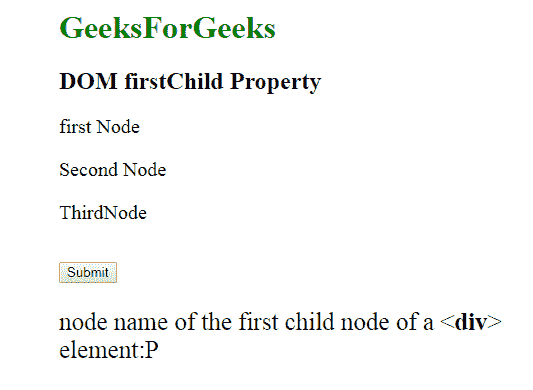

# HTML | DOM firstChild 属性

> 原文:[https://www.geeksforgeeks.org/html-dom-firstchild-property/](https://www.geeksforgeeks.org/html-dom-firstchild-property/)

**DOM 第一个子属性**用于返回其父节点元素的第一个子节点。它是只读属性，不返回文本节点和注释节点。

**语法:**

```html
node.firstChild 
```

**返回值:**返回一个代表节点第一个子节点的字符串值。如果元素没有子节点，则返回空值。

**注意:**父元素内部的空白被认为是文本，文本被认为是节点。

**示例-1:**

```html
<!DOCTYPE html>
<html>

<head>
    <style>
        h1 {
            color: green;
        }
    </style>
</head>

<body style="margin-left:140px;">
    <h1>GeeksForGeeks</h1>
    <h2>DOM firstChild Property </h2>

    <p>List of sorting::</p>
    <ul id="GFG"><li>Merge Sort</li>
    <li>Quick Sort</li>
    <li>Selection Sort</li>
    <li>Bubble Sort</li>
    </ul>
    <button onclick="Geeks()">Submit</button>
    <p id="sudo"></p>
    <script>
        function Geeks() {
            var x = 
            document.getElementById("GFG").firstChild.innerHTML;
            document.getElementById("sudo").innerHTML = x;
        }
    </script>
</body>

</html>
```

**输出:**
**点击按钮前:**


**点击按钮后:**


**示例-2:**

要获取第一个子节点的节点名-

```html
<!DOCTYPE html>
<html>
    <head>
        <style>
            h1 {
                color: green;
            }

            #GFG {
                font-size: 20px;
            }
        </style>
    </head>

    <body style="margin-left:140px;">
        <h1>GeeksForGeeks</h1>
        <h2>DOM firstChild Property </h2>
        <div id="GFG"><p>first Node</p><span>Second Node</span>
            <p>ThirdNode</p>
        </div>
        <br>
        <button onclick="Geeks()">Submit</button>

        <p id="sudo" style="font-size:25PX;"></p>

        <script>
            function Geeks() {
                var x = 
                document.getElementById("GFG").firstChild.nodeName;
                document.getElementById("sudo").innerHTML = 
                "node name of the first child node "
                + "of a <div> element:" + x;
            }
        </script>
    </body>
</html>                    
```

**输出:**
**点击按钮前:**


**点击按钮后:**


**支持的浏览器:**DOM first child 属性支持的浏览器如下:

*   谷歌 Chrome 1.0
*   Internet Explorer 4.0
*   Firefox 1.0
*   歌剧 3.5
*   Safari 1.0