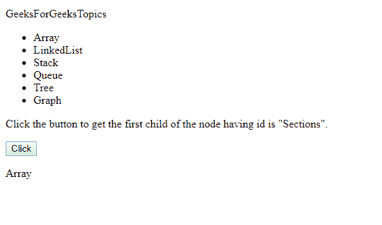

# HTML | DOM firstElementChild 属性

> 原文:[https://www . geesforgeks . org/html-DOM-first elementchild-property/](https://www.geeksforgeeks.org/html-dom-firstelementchild-property/)

HTML DOM**first element child**属性将返回任何节点的第一个子节点先决条件 [DOM(文档对象模型)](https://www.geeksforgeeks.org/dom-document-object-model/)
**参数:**
不需要参数。
**返回值:**
first element child 属性返回的值如下:

*   **节点对象:**表示元素的第一个子元素。

*   **空:**如果没有子元素。

**语法**

```html
node.firstElementChild()
```

**例:**

## 超文本标记语言

```html
<!DOCTYPE html>
<html>

<head>

    <head>
        HTML | DOM firstElementChild Property
    </head>
    <script>
        // JavaScript code to get the node whose
        // id is "Section"
        function example() {

            // x is used to store the element
            // whose id is "Sections".
            var x = document.getElementById("Sections" + ).firstElementChild.innerHTML;

            document.getElementById("GeeksForGeeks sections" +
                " first node").innerHTML = x;
        }
    </script>
</head>

<body>

<p>GeeksForGeeksTopics</p>

    <ul id="Sections">
        <li>Array</li>
        <li>LinkedList</li>
        <li>Stack</li>
        <li>Queue</li>
        <li>Tree</li>
        <li>Graph</li>

    </ul>

<p>
      Click the button to get the first child
      of the node having id is "Sections".
    </p>

    <!--button is used to run example function-->
    <button onclick="example()">Click</button>
    <p id="GeeksForGeeks sections first node"></p>

</body>

</html>
```

**输出**T2】



**支持的浏览器:****DOM first elementchild**支持的浏览器如下:

*   谷歌 Chrome
*   微软公司出品的 web 浏览器
*   火狐浏览器
*   歌剧
*   旅行队