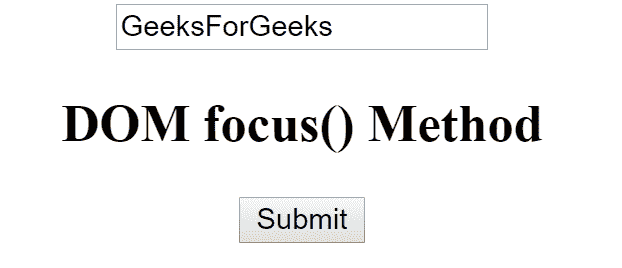
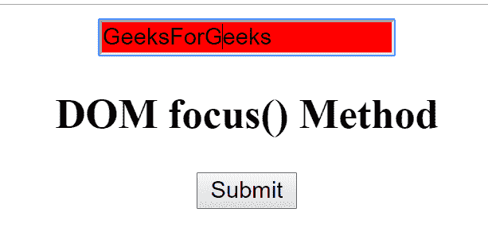
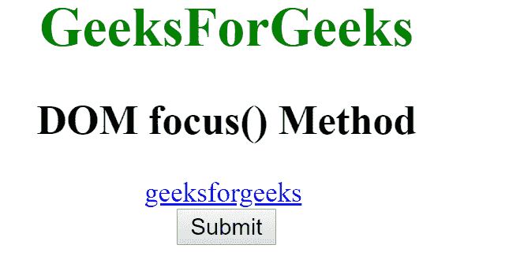
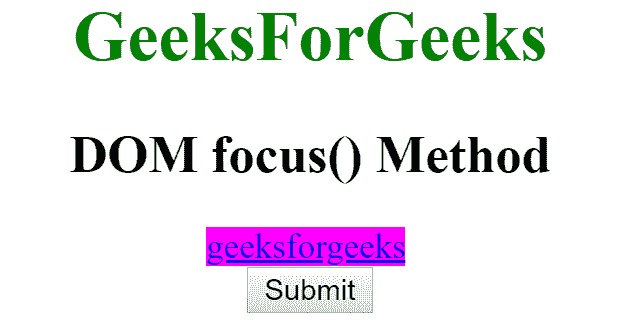

# HTML | DOM 焦点()方法

> 原文:[https://www.geeksforgeeks.org/html-dom-focus-method/](https://www.geeksforgeeks.org/html-dom-focus-method/)

**DOM focus()** 方法用于给元素赋予焦点，也可以借助于 blur()方法去除焦点。我们可以将焦点应用于任何元素，并通过执行一些操作来启用它。例如，我们可以通过点击一个按钮来聚焦一些文本。

**语法:**

```html
Object.focus()
```

**示例-1:**

```html
<!DOCTYPE html> 
<html> 
    <head> 
        <title>DOM focus() Method</title>
              <style>
                  input[type=text]:focus {
                   background-color: red;
                  }
               </style> 
    </head> 

    <body> 
        <center> 
            <input type="text" id="gfg" value="GeeksForGeeks">
            <h2>DOM focus() Method </h2>     
            <button type = "button" onclick = "geek()"> 
               Submit
            </button> 

            <script> 
               function geek() { 
               document.getElementById("gfg").focus(); 
               } 
            </script>

        </center> 
    </body> 
</html>                     
```

**输出:**
应用焦点前:

应用焦点后:


**示例-2:**

```html
<!DOCTYPE html> 
<html> 
    <head> 
        <title>DOM focus() Method</title> 
              <style>
                  a:focus {
                   background-color: magenta;
                 }
              </style> 
    </head> 
    <body> 
        <center> 
            <h1 style="color:green;"> 
                GeeksForGeeks 
            </h1> 

            <h2>DOM focus() Method</h2> 

            <a href="www.geeksforgeeks.com" 
                id = "geek">geeksforgeeks</a> 
            <br> 
            <button type = "button" onclick = "geeks()"> 
               Submit 
            </button> 

            <script> 
                function geeks() { 
                    document.getElementById("geek").focus();

                } 
            </script> 
        </center> 
    </body> 
```

**输出:**
应用焦点前:
T5】应用焦点后:

**支持的浏览器:**DOM focus()方法支持的浏览器如下:

*   谷歌 Chrome 15.0
*   Internet Explorer 11.0
*   Firefox 15.0
*   Opera 15.0
*   Safari 6.0