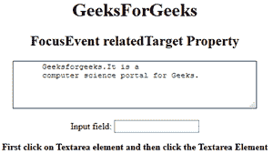
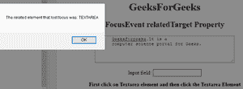

# HTML | DOM FocusEvent related target 属性

> 原文:[https://www . geesforgeks . org/html-DOM-focusevent-related target-property/](https://www.geeksforgeeks.org/html-dom-focusevent-relatedtarget-property/)

**DOM FocusEvent relatedTarget 属性**是*，用于返回与触发聚焦/模糊事件*的元素相关的元素的名称。它是只读属性。

*   对于 onfocus 和 onfocusin 事件，相关的元素是失去焦点的元素。
*   对于 on bulr 和 onfocusout 事件，相关的元素是 GOT focus 的元素。

**语法:**

```html
event.relatedTarget
```

**返回值:**返回对相关元素的引用，如果没有相关元素，则返回空值。
T3】例:

```html
<!DOCTYPE html>
<html>

<body style="text-align:center;">
    <h1>GeeksForGeeks </h1>
    <h2>FocusEvent relatedTarget Property</h2>
    <textarea rows="4" 
              cols="50">
      Geeksforgeeks.It is a
      computer science portal for Geeks.
  </textarea>
    <br>
    <br> Input field:
    <input type="text"
           onfocus="RelatedElement(event)">
    <p><b>First click on Textarea element
      and then click the Textarea Element</b></p>
    <script>
        function RelatedElement(event) {
            alert(
              "The related element that lost focus was: " 
              + event.relatedTarget.tagName);
        }
    </script>

</body>

</html>
```

**输出:**
**聚焦一个元素前:**



**聚焦一个元素后:**



**支持的浏览器:**T2 DOM FocusEvent related target Property 支持的浏览器如下:

*   谷歌 Chrome
*   Internet Explorer 9.0
*   Firefox 24.0
*   苹果 Safari
*   歌剧