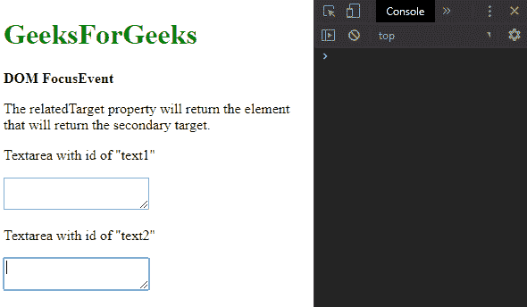
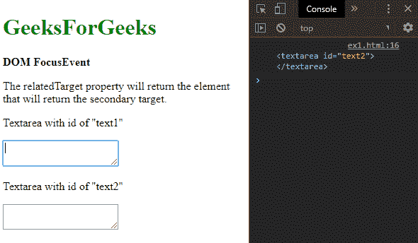
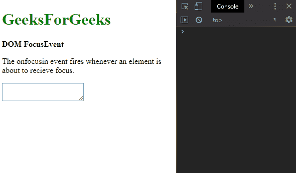
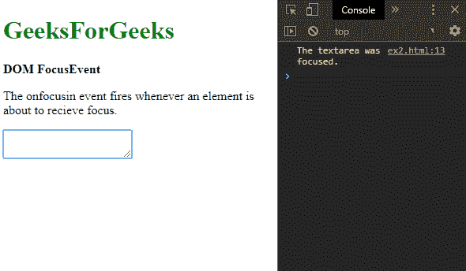
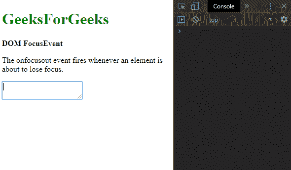
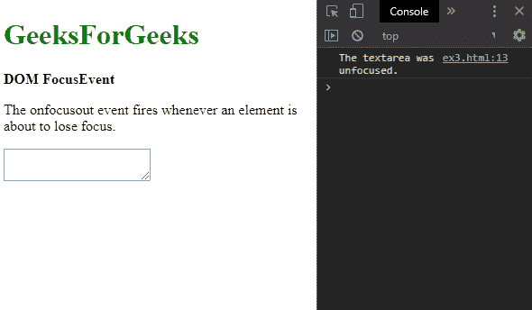

# HTML | DOM FocusEvent

> 原文:[https://www.geeksforgeeks.org/html-dom-focusevent/](https://www.geeksforgeeks.org/html-dom-focusevent/)

**DOM 焦点事件**对象包含与焦点相关的事件。它包括像聚焦、聚焦和模糊这样的事件。

**属性:**

*   **[relatedTarget](https://www.geeksforgeeks.org/html-dom-focusevent-relatedtarget-property/) :** 它返回与触发聚焦或模糊事件的元素相关的元素。出于安全原因，该值默认设置为 null。它是只读属性。

**示例:**用 relatedTarget 属性找出相关事件。

## 超文本标记语言

```html
<!DOCTYPE html>
<html>

<head>
    <title>DOM FocusEvent</title>
</head>

<body>
    <h1 style="color: green">
        GeeksForGeeks
    </h1>

    <b>DOM FocusEvent</b>
    <p>
        The relatedTarget property will 
        return the element that will
        return the secondary target.
    </p>

    <p>Textarea with id of "text1"</p>

    <textarea id="text1" 
        onfocus="getRelatedTarget()">
    </textarea>

    <p>Textarea with id of "text2"</p>

    <textarea id="text2"></textarea>

    <script>
        function getRelatedTarget() {
            console.log(this.event.relatedTarget);
        }
    </script>
</body>

</html>
```

**Output:**

*   **聚焦第二个文本区:**
    
*   **重新聚焦第一个文本区域:**
    

**事件类型:**

*   **[on bulr](https://www.geeksforgeeks.org/html-dom-onblur-event/):**每当元素获得焦点时，此事件就会触发。
*   **[聚焦](https://www.geeksforgeeks.org/html-dom-onfocus-event/) :** 每当事件失去焦点时，此事件就会触发。
*   **[聚焦](https://www.geeksforgeeks.org/html-dom-onfocusin-event/) :** 每当事件即将聚焦时，此事件就会触发。
*   **[焦点不集中](https://www.geeksforgeeks.org/html-dom-onfocusout-event/) :** 每当事件即将失去焦点时，此事件就会触发。

**示例:**这个示例实现了 onfocusin 事件。

## 超文本标记语言

```html
<!DOCTYPE html>
<html>

<head>
    <title>DOM FocusEvent</title>
</head>

<body>
    <h1 style="color: green">
        GeeksForGeeks
    </h1>

    <b>DOM FocusEvent</b>

    <p>
        The onfocusin event fires whenever an
        element is about to receive focus.
    </p>

    <textarea id="text1" onfocusin="fireEvent()">
    </textarea>

    <script>
        function fireEvent() {
            console.log("The textarea was focused.");
        }
    </script>
</body>

</html>
```

**Output:**

*   **点击文本区前:**
    
*   **点击后文字区:**
    

**示例:**这个示例实现了 onfocusout 事件。

## 超文本标记语言

```html
<!DOCTYPE html>
<html>

<head>
    <title>DOM FocusEvent</title>
</head>

<body>
    <h1 style="color: green">
        GeeksForGeeks
    </h1>

    <b>DOM FocusEvent</b>

    <p>
        The onfocusout event fires whenever an
        element is about to lose focus.
    </p>

    <textarea id="text1" onfocusout="fireEvent()">
    </textarea>

    <script>
        function fireEvent() {
            console.log("The textarea was unfocused.");
        }
    </script>
</body>

</html>
```

**Output:**

*   **点击退出文字区前:**
    
*   **点击后退出**
    

**支持的浏览器:***焦点事件*对象支持的浏览器如下:

*   铬
*   Firefox 24
*   Internet Explorer 9
*   旅行队
*   歌剧