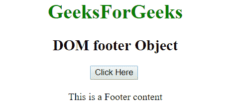
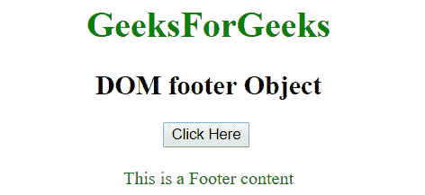
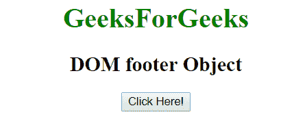
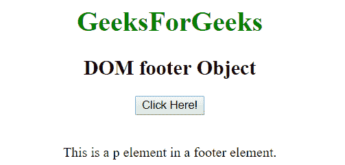

# HTML | DOM 页脚对象

> 原文:[https://www.geeksforgeeks.org/html-dom-footer-object/](https://www.geeksforgeeks.org/html-dom-footer-object/)

**DOM 页脚对象**用于表示 HTML <页脚>元素。可以使用 **getElementById()** 方法访问页脚元素。

**语法:**

```html
document.getElementById("id"); 
```

其中‘id’是分配给**页脚**标签的 ID。
**示例-1:** 在下面的程序中，页脚元素被访问，并且页脚元素内的文本颜色被改变。

## 超文本标记语言

```html
<!DOCTYPE html>
<html>
<body>
        <h1 style = "color:green;" >
          GeeksForGeeks
        </h1>

        <h2>DOM footer Object</h2>
        <button onclick="Geeks()">Click Here</button>
        <br><br>
        <footer id="s">This is a Footer content</footer> 

        <script>
        function Geeks() {
          var txt = document.getElementById("s");
          txt.style.color = "green";
        }
        </script>
</body>
</html>
```

**输出:**
**点击按钮前:**



**点击按钮后:**



**示例-2:** 可以使用 **document.createElement** 方法创建页脚对象。

## 超文本标记语言

```html
<!DOCTYPE html>
<html>
<body>
        <h1 style = "color:green;" >
          GeeksForGeeks
        </h1>

        <h2>DOM footer Object</h2>

        <button onclick="Geeks()">Click Here!</button><br><br>

        <p id="foot"></p>

        <script>
        function Geeks() {
            var x = document.createElement("FOOTER");
            document.body.appendChild(x);

            var y = document.createElement("P");
            var t = document.createTextNode("This is a p
                               element in a footer element.");
            y.appendChild(t);

            document.getElementById("foot").appendChild(y);
        }
        </script>
</body>
</html>
```

**输出:**
**点击按钮前:**



**点击按钮后:**



**支持的浏览器:**

*   谷歌 Chrome
*   Mozilla Firefox
*   internet Explorer(IE 8.0 之后)
*   旅行队
*   歌剧