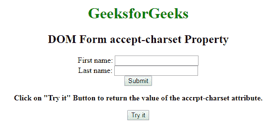
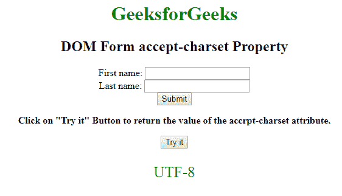
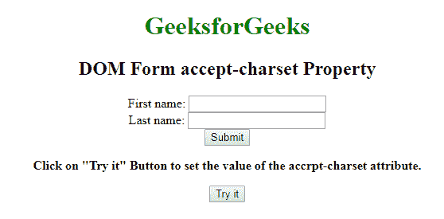
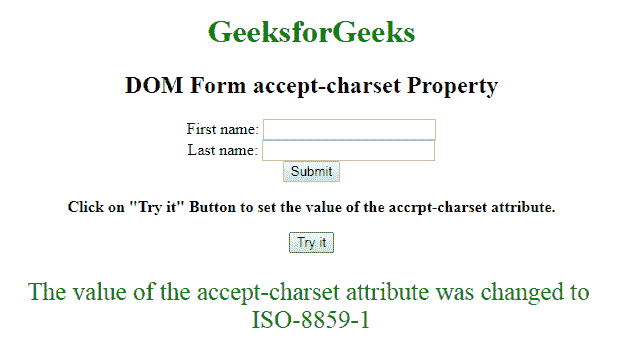

# HTML | DOM 表单接受属性

> 原文:[https://www . geesforgeks . org/html-DOM-form-accept charset-property/](https://www.geeksforgeeks.org/html-dom-form-acceptcharset-property/)

**DOM Form acceptCharset** 属性用于**设置**或**返回表单元素中 [**accept-charset 属性**](https://www.geeksforgeeks.org/html-accept-charset-attribute/) 的值。accept-charset 属性用于定义字符编码，并用于表单提交。accept-charset 属性的默认值是**“未知”**字符串，表示编码等于包含**

<form>element.

**语法:**

*   它用于返回 acceptCharset 属性。

    ```html
    formObject.acceptCharset
    ```

*   It is used to set the acceptCharset property.

    ```html
    formObject.acceptCharset = character-set
    ```

    **属性值:**

    *   **character-set :** The attribute value contains the list separated value of one or more encoding attributes. The common value of encoding attributes are: UTF-8, ISO-8859-1\. This attribute always associated with form element only.

        **示例-1:** 演示如何返回 accept-charset 属性的 HTML 程序。

        ```html
        <!DOCTYPE html>
        <html>

        <head>
            <title>DOM Form accept-charset Property</title>
            <style>
                h1 {
                    color: green;
                }

                body {
                    text-align: center;
                }
            </style>
        </head>

        <body>
            <h1>GeeksforGeeks</h1>
            <h2>DOM Form accept-charset Property</h2>
            <form action="#"
                  accept-charset="UTF-8"
                  id="users">
                First name:

                <input type="text" 
                       name="fname">
                <br> Last name:

                <input type="text" 
                       name="lname">
                <br>

                <input type="submit" 
                       value="Submit">
            </form>

            <p><b>Click on "Try it" Button to return the 
              value of the accrpt-charset attribute.</b></p>

            <button onclick="myGeeks()">Try it</button>
            <p id="sudo" style="font-size:25px;color:green;">
          </p>

            <script>
                function myGeeks() {

                    // Return accept-charset property
                    var x = document.getElementById(
                      "users").acceptCharset;

                    document.getElementById(
                      "sudo").innerHTML = x;
                }
            </script>
        </body>

        </html>
        ```

        **输出:**

        **点击按钮前:**
        

        **点击按钮后:**
        

        **示例-2:** 演示如何设置 accept-charset 属性的 HTML 程序。

        ```html
        <!DOCTYPE html>
        <html>

        <head>
            <title>DOM Form accept-charset Property
           </title>

            <style>
                h1 {
                    color: green;
                }

                body {
                    text-align: center;
                }
            </style>
        </head>

        <body>
            <h1>GeeksforGeeks</h1>
            <h2>DOM Form accept-charset Property
          </h2>

            <form action="#" 
                  accept-charset="UTF-8" 
                  id="users">
                First name:

                <input type="text" 
                       name="fname">
                <br> Last name:

                <input type="text"
                       name="lname">
                <br>

                <input type="submit" 
                       value="Submit">
            </form>

            <p><b>Click on "Try it" Button to set the 
              value of the accrpt-charset attribute.
              </b></p>

            <button onclick="myGeeks()">
              Try it
          </button>

            <p id="sudo"
               style="font-size:25px;color:green;">
          </p>

            <script>
                function myGeeks() {

                   // Set acceptCharset property.
                    var x = document.getElementById(
                      "users").acceptCharset = "ISO-8859-1";

                    document.getElementById("sudo").innerHTML =
                   "The value of the accept-charset attribute"
                    " was changed to " + "<br>" + x;
                }
            </script>
        </body>

        </html>
        ```

        **输出:**

        **点击按钮前:**
        

        **点击按钮后:**
        

        **支持的浏览器:**T2 DOM 表单接受字符集属性支持的浏览器如下:

        *   谷歌 Chrome
        *   微软公司出品的 web 浏览器
        *   火狐浏览器
        *   歌剧
        *   旅行队

</form>