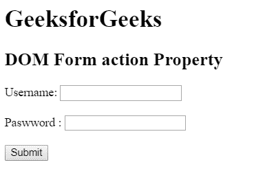
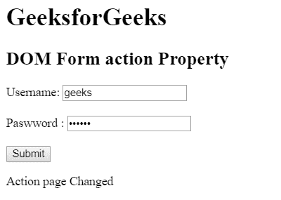
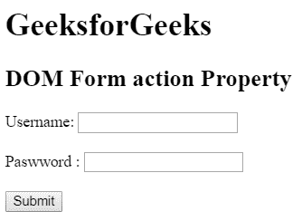
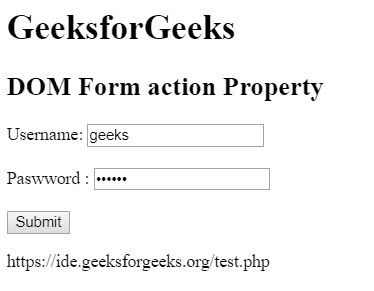

# HTML | DOM 表单动作属性

> 原文:[https://www . geesforgeks . org/html-DOM-form-action-property/](https://www.geeksforgeeks.org/html-dom-form-action-property/)

HTML DOM 中的**表单动作**属性用于设置或返回表单的动作属性值。提交表单后，操作属性被调用。表单数据将在提交表单后发送到服务器。

**语法:**

*   它用于返回操作属性。

    ```html
    formObject.action
    ```

*   It is used to set the action property.

    ```html
    formObject.action = URL
    ```

    **属性值:**

    *   **URL:** 用于指定表单提交后要发送数据的文档的 URL。
        网址的可能值有:

    *   **绝对 URL:** 指向另一个网站链接。例如:www.gfg.org
    *   **相对网址:**用于指向网页中的文件。例如:www.geeksforgeeks.org

**返回值:**返回一个代表表单网址的字符串值。

**例 1:** 本例描述如何设置动作属性。

```html
<!DOCTYPE html> 
<html> 

<head>
    <title>
        HTML DOM Form action Property
    </title>
</head>

<body> 
    <h1>GeeksforGeeks</h1>

    <h2>DOM Form action Property</h2>

    <form action="#" method="post" id="users"> 

        <label for="username">Username:</label> 
        <input type="text" name="username" id="Username">

        <br><br>

        <label for="password">Paswword :</label>
        <input type="password" name="password">
    </form>

    <br>

    <button onclick = "myGeeks()">
        Submit
    </button> 

    <p id = "GFG"></p>

    <!-- script to set action page -->
    <script>
    function myGeeks() {
        var x = document.getElementById("users").action
                = "/gfg.php";

        document.getElementById("GFG").innerHTML
            = "Action page Changed";
    }
    </script>
</body> 

</html>                    
```

**输出:**
**点击按钮前:**

**点击按钮后:**


**示例 2:** 本示例返回 action 属性。

```html
<!DOCTYPE html> 
<html> 

<head>
    <title>
        HTML DOM Form action Property
    </title>
</head>

<body> 
    <h1>GeeksforGeeks</h1>

    <h2>DOM Form action Property</h2>

    <form action="test.php" method="post" id="users"> 

        <label for="username">Username:</label> 
        <input type="text" name="username" id="Username">

        <br><br>

        <label for="password">Paswword :</label>
        <input type="password" name="password">
    </form>

    <br>

    <button onclick="myGeeks()">
        Submit
    </button> 

    <p id = "GFG"></p>

    <!-- script to return the the URL where 
            send the form data -->
    <script>
        function myGeeks() {
            var act = document.getElementById("users").action;
            document.getElementById("GFG").innerHTML = act;
        }
    </script>
</body> 

</html>                    
```

**输出:**
**点击按钮前:**

**点击按钮后:**


**支持的浏览器:***DOM Form 动作属性*支持的浏览器如下:

*   谷歌 Chrome
*   微软公司出品的 web 浏览器
*   火狐浏览器
*   歌剧
*   旅行队