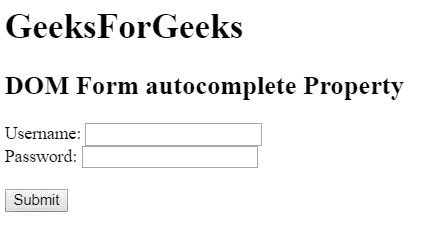
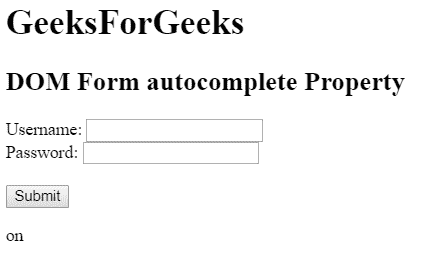
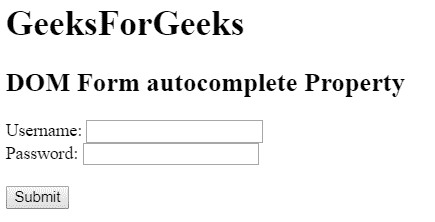
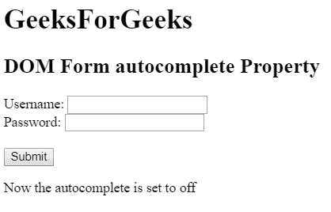

# HTML | DOM 表单自动完成属性

> 原文:[https://www . geesforgeks . org/html-DOM-form-autocomplete-property/](https://www.geeksforgeeks.org/html-dom-form-autocomplete-property/)

HTML DOM 中的**表单自动完成**属性用于设置或返回自动完成属性。自动完成属性用于指定自动完成属性的值是“开”还是“关”。当自动完成属性设置为 on 时，浏览器将自动完成用户之前输入的值。

**语法:**

*   它用于返回自动完成属性。

    ```html
    formObject.autocomplete
    ```

*   It is used to set the autocomplete property.

    ```html
    formObject.autocomplete = on|off
    ```

    **属性值:**

    *   **开:**为默认值。它会自动完成这些值。
    *   **off:** 定义用户填写输入字段的所有值。它不会自动完成值。

    **返回值:**返回一个代表自动完成属性状态的字符串值。

    **示例 1:** 这个 HTML 程序说明了如何返回属性。

    ```html
    <!DOCTYPE html> 
    <html> 

    <head>
        <title>
            HTML DOM Form autocomplete Property
        </title>
    </head>

    <body>

        <h1>GeeksForGeeks</h1>

        <h2>DOM Form autocomplete Property</h2>

        <form action="#" method="post" id="users" autocomplete="on"> 

            <label for="username">Username:</label> 

            <input type="text" name="username" id="Username"> <br>

            <label for="password">Password:</label> 

            <input type="password" name="password" id ="password"><br><br>
        </form> 

        <button onclick="myGeeks()">Submit</button>

        <p id="GFG"></p>

        <!-- Script to display autocomplete value -->
        <script>
        function myGeeks() {
            var auto_comp = document.getElementById("users").autocomplete;
            document.getElementById("GFG").innerHTML = auto_comp;
        }
        </script>
    </body> 

    </html>                                    
    ```

    **输出:**
    **点击按钮前:**
    
    **点击按钮后:**
    

    **示例 2:** 本示例将表单自动完成设置为关闭。

    ```html
    <!DOCTYPE html> 
    <html> 

    <head>
        <title>
            HTML DOM Form autocomplete Property
        </title>
    </head>

    <body>

        <h1>GeeksForGeeks</h1>

        <h2>DOM Form autocomplete Property</h2>

        <form action = "#" method="post" id="users" autocomplete="on"> 

            <label for="username">Username:</label> 
            <input type="text" name="username" id="Username"> <br>

            <label for="password">Password:</label> 
            <input type="password" name="password" id ="password"><br><br>
        </form> 

        <button onclick="myGeeks()">Submit</button>

        <p id="GFG"></p>

        <script>
        function myGeeks() {
            var x = document.getElementById("users").autocomplete = "off";

            document.getElementById("GFG").innerHTML
                    = "Now the autocomplete is set to " + x;
        }
        </script>
    </body> 

    </html>                    
    ```

    **输出:**
    **点击按钮前:**
    
    **点击按钮后:**
    

    **支持的浏览器:**T2 DOM 表单自动完成属性支持的浏览器如下:

    *   谷歌 Chrome
    *   微软公司出品的 web 浏览器
    *   火狐浏览器
    *   歌剧
    *   旅行队