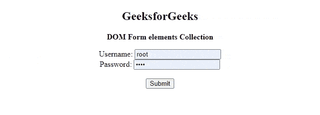
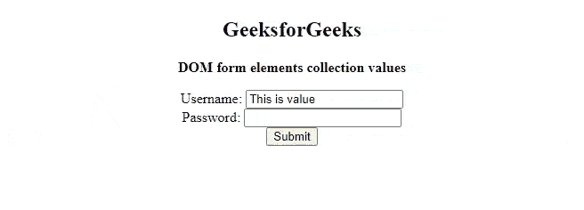

# HTML DOM 表单元素集合

> 原文:[https://www . geesforgeks . org/html-DOM-form-elements-collection/](https://www.geeksforgeeks.org/html-dom-form-elements-collection/)

HTML DOM 中的**表单元素集合**用于设置或返回一个[表单元素](https://www.geeksforgeeks.org/html-forms/)内所有 [<输入>](https://www.geeksforgeeks.org/html-input-tag/) 元素的集合。<输入>元素在源代码中出现时进行排序。

**语法:**

```html
formObject.elements
```

**属性:**返回<表单>元素内的多个输入元素。

**方法:**DOM 表单元素集合包含以下列出的三种方法–

*   **【索引】:**用于返回指定索引的<表单>元素内的<输入>元素。索引值从 0 开始。如果索引值超出范围，则返回空值。
*   **项(索引):**用于返回指定索引的<表单>元素内的<输入>元素。索引值从 0 开始。如果索引值超出范围，则返回空值。此方法的执行类似于上述方法。
*   **name item(id):**用于从集合中返回符合指定 id 的<输入>元素。如果 id 不存在，则返回空值。

**返回值** :-表单元素集合返回表单元素
内所有<输入>元素的集合

**示例 1:** 下面的代码返回表单内部输入字段的数量。

## 超文本标记语言

```html
<!DOCTYPE html>
<html>

<head>
    <title>
        HTML DOM Form elements Collection
    </title>
</head>

<body>
    <center>
        <h2>GeeksforGeeks</h2>

<p><b>DOM Form elements Collection</b></p>

        <form action="#" method="post" id="users" autocomplete="on">
            <label for="username">Username:</label>
            <input type="text" name="username" id="Username"> <br>

            <label for="password">Password:</label>
            <input type="password" name="password" id="password">
            <br><br>
        </form>

        <button onclick="click1()">Submit</button>

        <p id="paraID"></p>

    </center>

    <!-- Script to display length of input -->
    <script>
        function click1() {
            var len = document.getElementById("users").elements.length;
            document.getElementById("paraID").innerHTML =
                "There are " + len + " input fields inside form";
        }
    </script>
</body>

</html>
```

**输出:**



**示例 2:** 下面的代码返回指定索引的输入字段的值。

## 超文本标记语言

```html
<!DOCTYPE html>
<html>

<head>
    <title>
        HTML DOM form elements Collection
    </title>
</head>

<body>
    <center>
        <h2>GeeksforGeeks</h2>

<p><b>DOM form elements collection values</b></p>

        <form action="#" method="post" id="users"
            autocomplete="on">

            <label for="username">Username:</label>
            <input type="text" name="username"
                value="This is value" id="Username">
            <br>

            <label for="password">Password:</label>
            <input type="password" name="password"
                id="password"><br>
        </form>

        <button onclick="click1()">Submit</button>
        <p id="paraID"></p>

    </center>

    <!-- Script to display value of
        input field of input -->
    <script>
        function click1() {
            var valueVar = document.getElementById(
                    "users").elements[0].value;

            document.getElementById("paraID")
                .innerHTML = valueVar;
        }
    </script>
</body>

</html>
```

**输出:**



**支持的浏览器:**

*   谷歌 Chrome
*   微软公司出品的 web 浏览器
*   歌剧
*   火狐浏览器
*   苹果 Safari