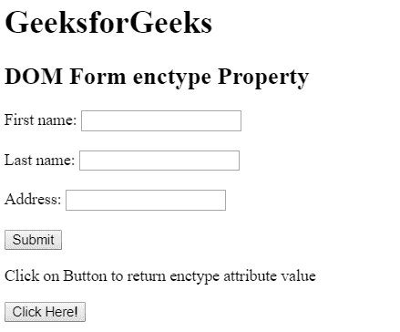
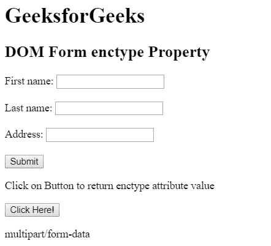
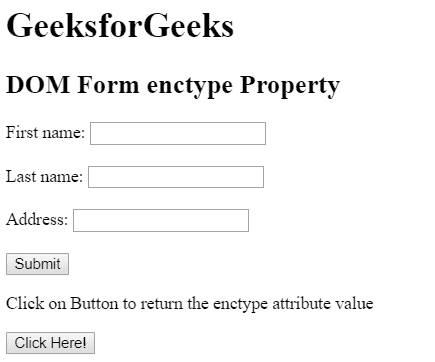
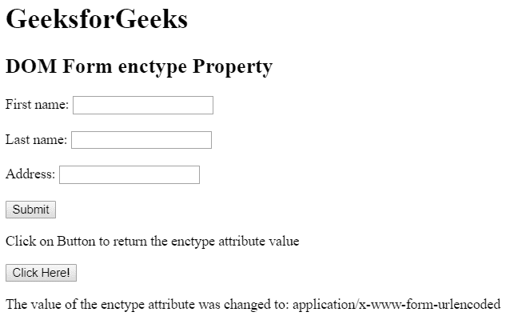

# HTML | DOM 表单封装属性

> 原文:[https://www . geesforgeks . org/html-DOM-form-enctype-property/](https://www.geeksforgeeks.org/html-dom-form-enctype-property/)

HTML DOM 中的**表单 enctype** 属性用于设置或返回表单中 enctype 属性的值。此属性指定将呈现在表单中的数据在提交给服务器时应该被编码。只有当 method = "POST "时，才能使用这种类型的属性。

**语法:**

*   它用于返回 enctype 属性。

    ```html
    formObject.enctype
    ```

*   It is used to set the enctype property.

    ```html
    formObject.enctype = "application/x-www-form-urlencoded, multipart/form-data, text/plain"
    ```

    **属性值:**

    *   **application/x-www-form-URL encoded:**为默认值。它在发送到服务器之前对所有字符进行编码。它将空格转换成+符号，将特殊字符转换成十六进制值。
    *   **多部分/表单数据:**该值不编码任何字符。
    *   **文本/普通:**该值将空格转换为+符号，但不转换特殊字符。

    **返回值**它返回一个字符串值，代表表单数据发送到服务器时的编码类型。

    **示例 1:** 本示例使用 getElementById()方法返回 enctype 属性。

    ```html
    <!DOCTYPE html> 
    <html> 
        <head> 
            <title>
                HTML DOM Form enctype Property
            </title> 
        </head> 

        <body> 

            <h1>GeeksforGeeks</h1> 

            <h2>DOM Form enctype Property</h2> 

            <form action="#" id="GFG" method="post"
                        enctype="multipart/form-data"> 

                First name: <input type="text" name="fname">

                <br><br> 

                Last name: <input type="text" name="lname">

                <br><br> 

                Address: <input type="text" name="Address">

                <br><br> 

                <input type="submit" value="Submit"> 
            </form>

            <p>
                Click on Button to return enctype
                attribute value
            </p>

            <button onclick = "myGeeks()">
                Click Here!
            </button>

            <p id = "sudo"></p>

            <!-- Script to return enctype property value -->
            <script>
                function myGeeks() {
                    var x = document.getElementById("GFG").enctype;
                    document.getElementById("sudo").innerHTML = x;
                }
            </script>
        </body> 
    </html>                            
    ```

    **输出:**
    **点击按钮前:**
    
    **点击按钮后:**
    

    **示例 2:** 本示例设置 enctype 属性。

    ```html
    <!DOCTYPE html> 
    <html> 
        <head> 
            <title>
                HTML DOM Form enctype Property
            </title> 
        </head> 

        <body> 

            <h1>GeeksforGeeks</h1> 

            <h2>DOM Form enctype Property</h2> 

            <form action="#" id="GFG" method="post" 
                        enctype="multipart/form-data"> 

                First name: <input type="text" name="fname">

                <br><br> 

                Last name: <input type="text" name="lname">

                <br><br> 

                Address: <input type="text" name="Address">

                <br><br> 

                <input type="submit" value="Submit"> 
            </form>

            <p>
                Click on Button to return the
                enctype attribute value
            </p>

            <button onclick="myGeeks()">
                Click Here!
            </button>

            <p id="sudo"></p>

            <!-- Script to set enctype attribute value -->
            <script>
                function myGeeks() {
                    var x = document.getElementById("GFG").enctype 
                            = "application/x-www-form-urlencoded";
                    document.getElementById("sudo").innerHTML
                            = "The value of the enctype attribute"
                            + " was changed to: " + x;
                }
            </script>
        </body> 
    </html>                    
    ```

    **输出:**
    **点击按钮前:**
    
    **点击按钮后:**
    

    **支持的浏览器:**T2 DOM Form enctype 属性支持的浏览器如下:

    *   谷歌 Chrome
    *   微软公司出品的 web 浏览器
    *   火狐浏览器
    *   歌剧
    *   旅行队