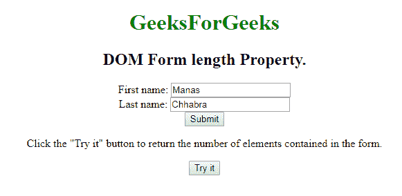
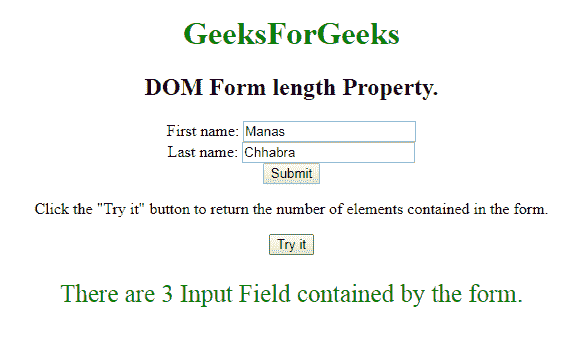
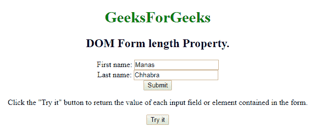
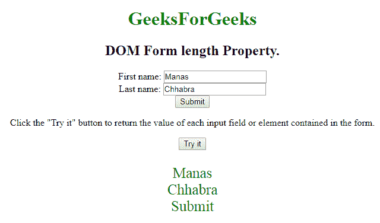

# HTML | DOM 表单长度属性

> 原文:[https://www . geesforgeks . org/html-DOM-form-length-property/](https://www.geeksforgeeks.org/html-dom-form-length-property/)

**DOM 表单长度**属性用于返回表单中包含的输入字段的**号。**

**语法:**

```html
formObject.length
```

**返回值:**返回一个代表表单中输入字段或元素数量的数值。

**例-1:** 返回输入字段的编号。

```html
<!DOCTYPE html>
<html>

<body style="text-align:center;">
    <h1 style="color:green;">
      GeeksForGeeks
  </h1>

    <h2>DOM Form length Property.
  </h2>

    <form id="users" 
          action="#">
        First name:

        <input type="text" 
               name="fname"
               value="Manas">
        <br> Last name:

        <input type="text"
               name="lname" 
               value="Chhabra">
        <br>

        <input type="submit" 
               value="Submit">
    </form>

    <p>Click the "Try it" button to return 
      the number of elements contained in the form.</p>

    <button onclick="myGeeks()">
      Try it
  </button>

    <p id="sudo" 
       style="font-size:25px;color:green;">
  </p>

    <script>
        function myGeeks() {

            // Return the number of input field
            var x =
                document.getElementById(
                  "users").length;

            document.getElementById("sudo").innerHTML = 
              "There are " + x + 
              " Input Field contained by the form.";
        }
    </script>

</body>

</html>
```

**输出:**

**点击按钮前:**


**点击按钮后:**


**示例-2:** 返回输入字段的值。

```html
<!DOCTYPE html>
<html>

<body style="text-align:center;">
    <h1 style="color:green;">
      GeeksForGeeks
  </h1>

    <h2>DOM Form length Property.</h2>
    <form id="users" 
          action="#">
        First name:

        <input type="text" 
               name="fname" 
               value="Manas">
        <br> Last name:

        <input type="text"
               name="lname" 
               value="Chhabra">
        <br>

        <input type="submit"
               value="Submit">
    </form>

    <p>Click the "Try it" button to return
      the value of each input field or element 
      contained in the form.</p>

    <button onclick="myGeeks()">Try it</button>

    <p id="sudo" style="font-size:25px;color:green;">
  </p>

    <script>
        function myGeeks() {

            //  Return values of input field.
            var x = document.getElementById("users");
            var text = "";
            var i = 0;
            for (i = 0; i < x.length; i++) {
                text = text + x.elements[i].value + "<br>";
            }
            document.getElementById("sudo").innerHTML = text;
        }
    </script>

</body>

</html>
```

**输出:**

**点击按钮前:**


**点击按钮后:**


**支持的浏览器:**T2 DOM 表单长度属性支持的浏览器如下:

*   谷歌 Chrome
*   微软公司出品的 web 浏览器
*   火狐浏览器
*   歌剧
*   旅行队