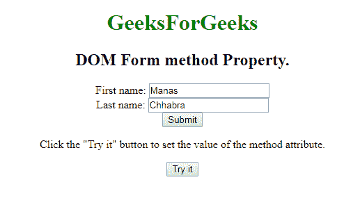
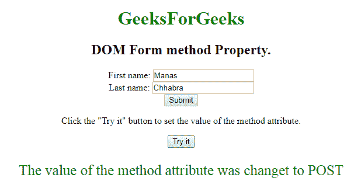
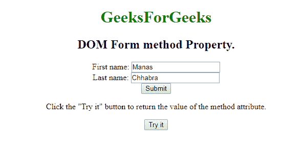
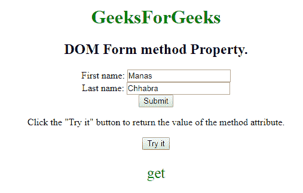

# HTML | DOM 表单方法属性

> 原文:[https://www . geesforgeks . org/html-DOM-form-method-property/](https://www.geeksforgeeks.org/html-dom-form-method-property/)

**DOM Form 方法**属性用于**设置**或**返回**表单中方法属性的值。方法属性用于指定提交表单时用于发送数据的 **HTTP 方法**。HTTP 方式有两种，分别是 **GET** 和 **POST** 。

**语法:**

*   用于返回方法属性:

    ```html
    formObject.method
    ```

*   It is used to Set the method property.

    ```html
    formObject.method = get|post
    ```

    **属性值**

    *   **GET:** 在 GET 方法中，表单提交后，表单值会在新浏览器选项卡的地址栏中可见。
    *   **POST:** 在 POST 方法中，表单提交后，表单值在新浏览器选项卡的地址栏中将不会像在 GET 方法中一样可见。

    **返回值**返回一个**字符串值**，代表提交表单时用来发送数据的 *HTTP 方法。*

    **示例-1:** 演示如何设置属性的 HTML 程序。

    ```html
    <!DOCTYPE html>
    <html>

    <body style="text-align:center;">
        <h1 style="color:green;">
          GeeksForGeeks
      </h1>

        <h2>DOM Form method Property.</h2>
        <form id="users" 
              action="#" 
              method="GET"
              target="_blank">
            First name:

            <input type="text" 
                   name="fname"
                   value="Manas">

            <br> Last name:
            <input type="text"
                   name="lname" 
                   value="Chhabra">

            <br>
            <input type="submit" 
                   value="Submit">
        </form>

        <p>Click the "Try it" button to return the
          value contained in the form.</p>

        <button onclick="myGeeks()">Try it</button>

        <p id="sudo"
           style="font-size:25px;color:green;">
      </p>

        <script>
            function myGeeks() {

                // Set property of method.
                var x =
                    document.getElementById("users").method = 
                    "POST";
                document.getElementById("sudo").innerHTML = 
                  "The value of the method attribute was changet to "
                + x;
            }
        </script>

    </body>

    </html>
    ```

    **输出:**

    **点击按钮前:**
    

    **点击按钮后:**
    
    **示例-2:** HTML 程序说明如何返回属性。

    ```html
    <!DOCTYPE html>
    <html>

    <body style="text-align:center;">
        <h1 style="color:green;">
          GeeksForGeeks
      </h1>
        <h2>DOM Form method Property.
      </h2>

        <form id="users" 
              action="#" 
              method="GET" 
              target="_blank">
            First name:

            <input type="text" 
                   name="fname" 
                   value="Manas">
            <br> Last name:

            <input type="text"
                   name="lname"
                   value="Chhabra">
            <br>

            <input type="submit"
                   value="Submit">
        </form>

        <p>Click the "Try it" button to return 
          the value of the method attribute.</p>

        <button onclick="myGeeks()">
          Try it
      </button>

        <p id="sudo" 
           style="font-size:25px;color:green;">
      </p>

        <script>
            function myGeeks() {

                // Return the property value 
                var x = document.getElementById(
                  "users").method;
                document.getElementById(
                  "sudo").innerHTML = x;
            }
        </script>

    </body>

    </html>
    ```

    **输出:**

    **点击按钮前:**
    

    **点击按钮后:**
    

    **支持的浏览器:***DOM Form 方法属性*支持的浏览器如下:

    *   谷歌 Chrome
    *   微软公司出品的 web 浏览器
    *   火狐浏览器
    *   歌剧
    *   旅行队