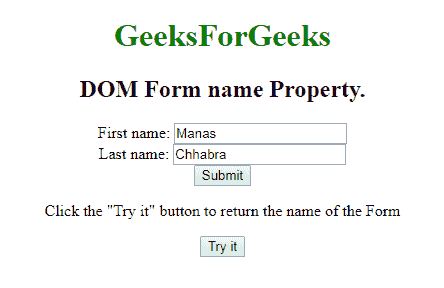
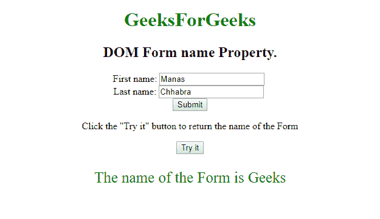
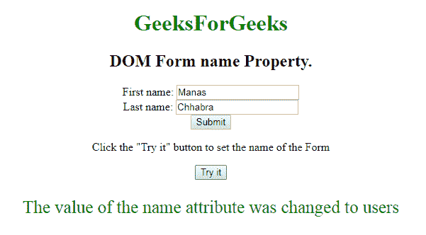

# HTML | DOM 表单名称属性

> 原文:[https://www.geeksforgeeks.org/html-dom-form-name-property/](https://www.geeksforgeeks.org/html-dom-form-name-property/)

**DOM Form name** Property 用于**设置**或**返回表单中**名称属性**的值。每个输入字段都需要名称属性。如果未在输入字段中指定 name 属性，则根本不会发送该字段的数据。**

**语法:**

*   它用于返回 name 属性。

    ```html
    formObject.name
    ```

*   It is used to set the name property.

    ```html
    formObject.name = name
    ```

    **属性值**

    *   **名称:**指定表单的名称。

    **返回值:**返回代表表单名称的字符串值。

    **示例-1:** 说明如何返回属性的 HTML 程序。

    ```html
    <!DOCTYPE html>
    <html>

    <body style="text-align:center;">
        <h1 style="color:green;">
          GeeksForGeeks
      </h1>

        <h2>DOM Form name Property.</h2>
        <form id="users" 
              action="#" 
              name="Geeks">
            First name:

            <input type="text" 
                   name="fname" 
                   value="Manas">
            <br> Last name:

            <input type="text" 
                   name="lname" 
                   value="Chhabra">
            <br>

            <input type="submit" 
                   value="Submit">
        </form>

        <p>Click the "Try it" button to return
          the name of the Form </p>

        <button onclick="myGeeks()">
          Try it
        </button>

        <p id="sudo" 
           style="font-size:25px;color:green;">
      </p>

        <script>
            function myGeeks() {

                //  Return the property
                var x = document.getElementById(
                  "users").name;

                document.getElementById("sudo").innerHTML = 
                  "The name of the Form is " + x;
            }
        </script>

    </body>

    </html>
    ```

    **输出:**

    **点击按钮前:**
    

    **点击按钮后:**
    

    **示例-2:** 演示如何设置属性的 HTML 程序。

    ```html
    <!DOCTYPE html>
    <html>

    <body style="text-align:center;">
        <h1 style="color:green;">GeeksForGeeks</h1>
        <h2>DOM Form name Property.</h2>

        <form id="users" 
              action="#"
              name="Geeks">
            First name:

            <input type="text"
                   name="fname" 
                   value="Manas">
            <br> Last name:

            <input type="text" 
                   name="lname" 
                   value="Chhabra">
            <br>

            <input type="submit" 
                   value="Submit">
        </form>

        <p>Click the "Try it" button to 
          set the name of the Form </p>

        <button onclick="myGeeks()">
          Try it
      </button>

        <p id="sudo"
           style="font-size:25px;
                  color:green;">
      </p>

        <script>
            function myGeeks() {

                // Set the name attribute value.
                var x = document.getElementById(
                  "users").name = "users";
                document.getElementById("sudo").innerHTML = 
                  "The value of the name attribute was changed to "
                + x;
            }
        </script>

    </body>

    </html>
    ```

    **输出:**

    **点击按钮前:**
    

    **点击按钮后:**
    

    **支持的浏览器:***DOM 表单名称属性*支持的浏览器如下:

    *   谷歌 Chrome
    *   微软公司出品的 web 浏览器
    *   火狐浏览器
    *   歌剧
    *   旅行队