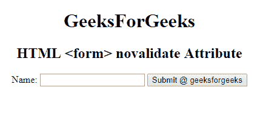
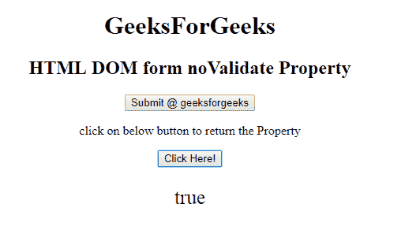
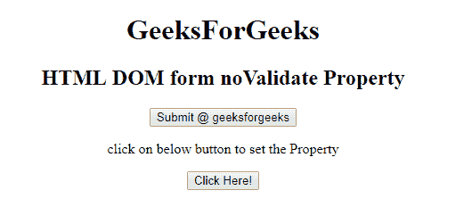
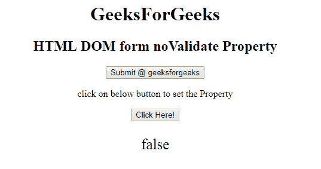

# HTML | DOM 表单更新属性

> 原文:[https://www . geesforgeks . org/html-DOM-form-novalidate-property/](https://www.geeksforgeeks.org/html-dom-form-novalidate-property/)

HTML DOM 中的**表单更新属性**用于在提交表单时设置或返回表单数据是否需要验证。此属性用于反映 HTML 表单验证属性。

**语法:**

*   它返回新数据属性。

    ```html
    formObject.noValidate 
    ```

*   用于设置新数据属性。

    ```html
    formObject.noValidate = true|false 
    ```

**属性值:**

*   **true:** 指定表单数据不应该被验证。
*   **false:** 为默认值。它指定应该验证表单数据。

**返回值:**返回一个字符串值，表示提交表单时表单数据是否应该被验证。

**示例:**此示例说明如何返回表单 NoValidate 属性。

```html
<!DOCTYPE html>
<html>

<head>
    <title>
        HTML DOM form noValidate Property
    </title>
</head>

<body style="text-align:center;">
    <h1> 
        GeeksForGeeks 
    </h1>

    <h2> 
        HTML DOM form noValidate Property 
    </h2>

    <form id="gfg" 
          action="#"
          method="get"
          target="_self" 
          noValidate>

        <input type="submit" 
               id="Geeks" 
               name="myGeeks" 
               value="Submit @ geeksforgeeks" 
               formTarget="_blank">
    </form>

    <p>
        click on below button to return the Property
    </p>

    <button onclick="myGeeks()">
        Click Here!
    </button>

    <p id="GFG" 
       style="font-size:25px;"></p>

    <!-- Script to return form 
         formnovalidate Property -->
    <script>
        function myGeeks() {
            var btn = document.getElementById(
              "gfg").noValidate;

            document.getElementById(
              "GFG").innerHTML = btn;
        }
    </script>
</body>

</html>
```

**输出:**
**点击按钮前:**

**点击按钮后:**


**示例:**此示例说明如何设置表单 NoValidateproperty。

```html
<!DOCTYPE html>
<html>

<head>
    <title>
        HTML DOM form noValidate Property
    </title>
</head>

<body style="text-align:center;">
    <h1> 
        GeeksForGeeks 
    </h1>

    <h2> 
        HTML DOM form noValidate Property 
    </h2>

    <form id="gfg"
          action="#" 
          method="get" 
          target="_self" 
          noValidate>

        <input type="submit" 
               id="Geeks" 
               name="myGeeks" 
               value="Submit @ geeksforgeeks" 
               formTarget="_blank">
    </form>

    <p>
        click on below button to set the Property
    </p>

    <button onclick="myGeeks()">
        Click Here!
    </button>

    <p id="GFG" 
       style="font-size:25px;"></p>

    <!-- Script to return form
formnovalidate Property -->
    <script>
        function myGeeks() {
            var btn = document.getElementById(
              "gfg").noValidate = false;

            document.getElementById(
              "GFG").innerHTML = btn;
        }
    </script>
</body>

</html>
```

**输出:**
**点击按钮前:**

**点击按钮后:**


**支持的浏览器:****DOM Form noValidate Property**支持的浏览器如下:

*   谷歌 Chrome
*   微软公司出品的 web 浏览器
*   火狐浏览器
*   歌剧