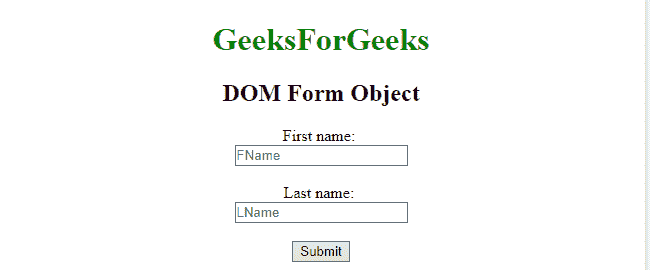
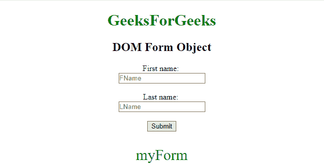
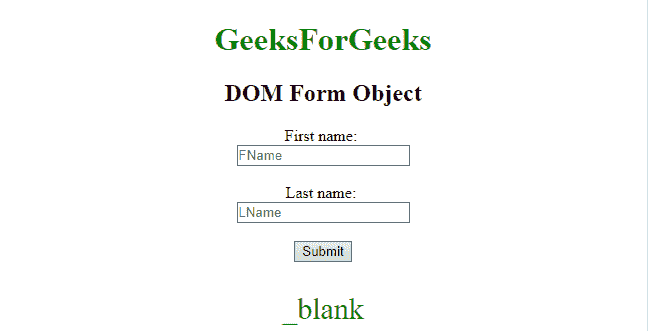
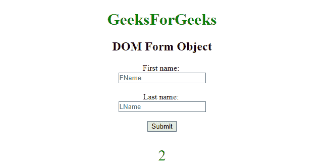

# HTML | DOM 表单对象

> 原文:[https://www.geeksforgeeks.org/html-dom-form-object/](https://www.geeksforgeeks.org/html-dom-form-object/)

HTML DOM 中的**表单对象**用来表示 HTML [<表单>](https://www.geeksforgeeks.org/html-form-tag/) 元素。
此标签用于**设置**或**获取****<的属性形成>** 元素。可以使用 **getElementById()** 方法访问该元素。

**语法:**

```html
document.getElementById("Form_ID");

```

该表单标识被分配给 HTML < form >元素。

**示例-1:** 使用**文档返回**“表单标识”**。id；**

```html
<!DOCTYPE html>
<html>

<head>
    <title>
        HTML DOM Form Object
    </title>
</head>

<body style="text-align:center;">

    <h1 style="color:green;">  
            GeeksForGeeks  
        </h1>

    <h2>DOM Form Object</h2>

    <form align="center" 
          id="myForm" 
          method="GET" 
          target="_blank"
          action="/action_page.php">
        First name:
        <br>
        <input type="text"
               name="fname" 
               placeholder="FName">
        <br>
        <br> Last name:
        <br>
        <input type="text" 
               name="lname" 
               placeholder="LName">
        <br>
        <br>
    </form>
    <button onclick="myGeeks()">
        Submit
    </button>
    <p id="Geek_p" 
       style="color:green; 
              font-size:30px;">
    </p>

    <script>
        function myGeeks() {
            // Accessing form element.
            var txt = document.getElementById(
              "myForm").id;

            document.getElementById(
              "Geek_p").innerHTML = txt;
        }
    </script>
</body>

</html>
```

**输出**

*   **之前点击按钮:**
    
*   **点击按钮后:**
    

**示例-2:** 使用**文档返回表单中目标属性的值。目标；**。

```html
<!DOCTYPE html>
<html>

<head>
    <title>
        HTML DOM Form Object
    </title>
</head>

<body style="text-align:center;">

    <h1 style="color:green;">  
            GeeksForGeeks  
        </h1>

    <h2>DOM Form Object</h2>

    <form align="center" 
          id="myForm"
          method="GET" 
          target="_blank"
          action="/action_page.php">
        First name:
        <br>
        <input type="text"
               name="fname" 
               placeholder="FName">
        <br>
        <br> Last name:
        <br>
        <input type="text" 
               name="lname" 
               placeholder="LName">
        <br>
        <br>
    </form>
    <button onclick="myGeeks()">
        Submit
    </button>
    <p id="Geek_p" 
       style="color:green; 
              font-size:30px;">
    </p>

    <script>
        function myGeeks() {

            //  Accessing form.
            var txt = document.getElementById(
              "myForm").target;

            document.getElementById(
              "Geek_p").innerHTML = txt;
        }
    </script>
</body>

</html>
```

**输出**

*   **之前点击按钮:**
    
*   **点击按钮后:**
    

**示例-3:** 使用**文档返回表单中的元素数量。长度；**。

```html
<!DOCTYPE html>
<html>

<head>
    <title>
        HTML DOM Form Object
    </title>
</head>

<body style="text-align:center;">

    <h1 style="color:green;">  
            GeeksForGeeks  
        </h1>

    <h2>DOM Form Object</h2>

    <form align="center"
          id="myForm" 
          method="GET" 
          target="_blank"
          action="/action_page.php">
        First name:
        <br>
        <input type="text"
               name="fname" 
               placeholder="FName">
        <br>
        <br> Last name:
        <br>
        <input type="text"
               name="lname" 
               placeholder="LName">
        <br>
        <br>
    </form>
    <button onclick="myGeeks()">
        Submit
    </button>
    <p id="Geek_p"
       style="color:green;
              font-size:30px;">
    </p>

    <script>
        function myGeeks() {

          //Accessing form element.
          var txt = document.getElementById(
            "myForm").length;

            document.getElementById(
              "Geek_p").innerHTML = txt;
        }
    </script>
</body>

</html>
```

**输出**

*   **之前点击按钮:**
    
*   **点击按钮后:**
    

**支持的浏览器:**

*   谷歌 Chrome
*   Mozilla Firefox
*   边缘
*   旅行队
*   歌剧