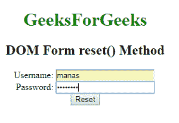
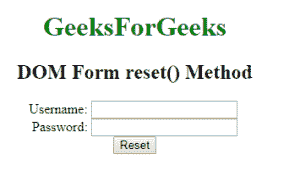

# HTML | DOM 表单重置()方法

> 原文:[https://www.geeksforgeeks.org/html-dom-form-reset-method/](https://www.geeksforgeeks.org/html-dom-form-reset-method/)

HTML DOM 中的**表单重置()方法**用于重置表单元素的所有值，并使用默认值。此方法作为重置按钮工作。它不包含任何参数。

**语法:**

```html
formObject.reset()
```

**示例:**

```html
<!DOCTYPE html> 
<html> 

<head>
    <title>
        HTML DOM Form reset() Method
    </title>
</head>

<body> 
    <h1 style="color:green;">
        GeeksForGeeks
    </h1>

    <h2>DOM Form reset() Method</h2>

    <!-- HTML code to create form -->
    <form action="#" method="post" id="users"> 

        <label for="username">Username:</label> 
        <input type="text" name="username" id="Username">

        <br>

        <label for="password">Password:</label>
        <input type="password" name="password" id ="password">

        <br>

        <input type="reset" id="GFG" value="Reset"> 
    </form> 

    <!-- script to use reset() method -->
    <script>
        document.getElementById("GFG").reset();
    </script>
</body> 

</html>                    
```

**输出:**
**点击按钮前:**

**点击按钮后:**


**支持的浏览器:***DOM Form reset()方法*支持的浏览器如下:

*   谷歌 Chrome
*   微软公司出品的 web 浏览器
*   火狐浏览器
*   歌剧
*   旅行队