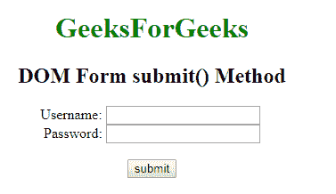

# HTML | DOM 表单提交()方法

> 原文:[https://www.geeksforgeeks.org/html-dom-form-submit-method/](https://www.geeksforgeeks.org/html-dom-form-submit-method/)

HTML DOM 中的**表单提交()方法**用于将表单数据发送到网络服务器。它的工作原理与提交按钮相同。它不包含任何参数。

**语法:**

```html
formObject.submit()
```

**示例:**

```html
<!DOCTYPE html> 
<html> 

<head>
    <title>
        HTML DOM Form submit() Method
    </title>
</head>

<body style="text-align:center;"> 

    <h1 style="color:green;">
        GeeksForGeeks
    </h1>

    <!-- HTML code to create form -->
    <h2>DOM Form submit() Method</h2>

    <form id="GFG" action="https://ide.geeksforgeeks.org/tryit.php">
          <label for="username">Username:</label> 
        <input type="text" name="username" id="Username">

        <br>

        <label for="password">Password:</label> 
        <input type="password" name="password" id ="password">

        <br><br>
          <input type="button" onclick="myGeeks()" value="Submit form">
    </form>

    <!-- script to use submit() method -->
    <script>
        function myGeeks() {
              document.getElementById("GFG").submit();
        }
    </script>
</body>

</html>
```

**输出:**


**支持的浏览器:***DOM Form submit()方法*支持的浏览器如下:

*   谷歌 Chrome
*   微软公司出品的 web 浏览器
*   火狐浏览器
*   歌剧
*   旅行队